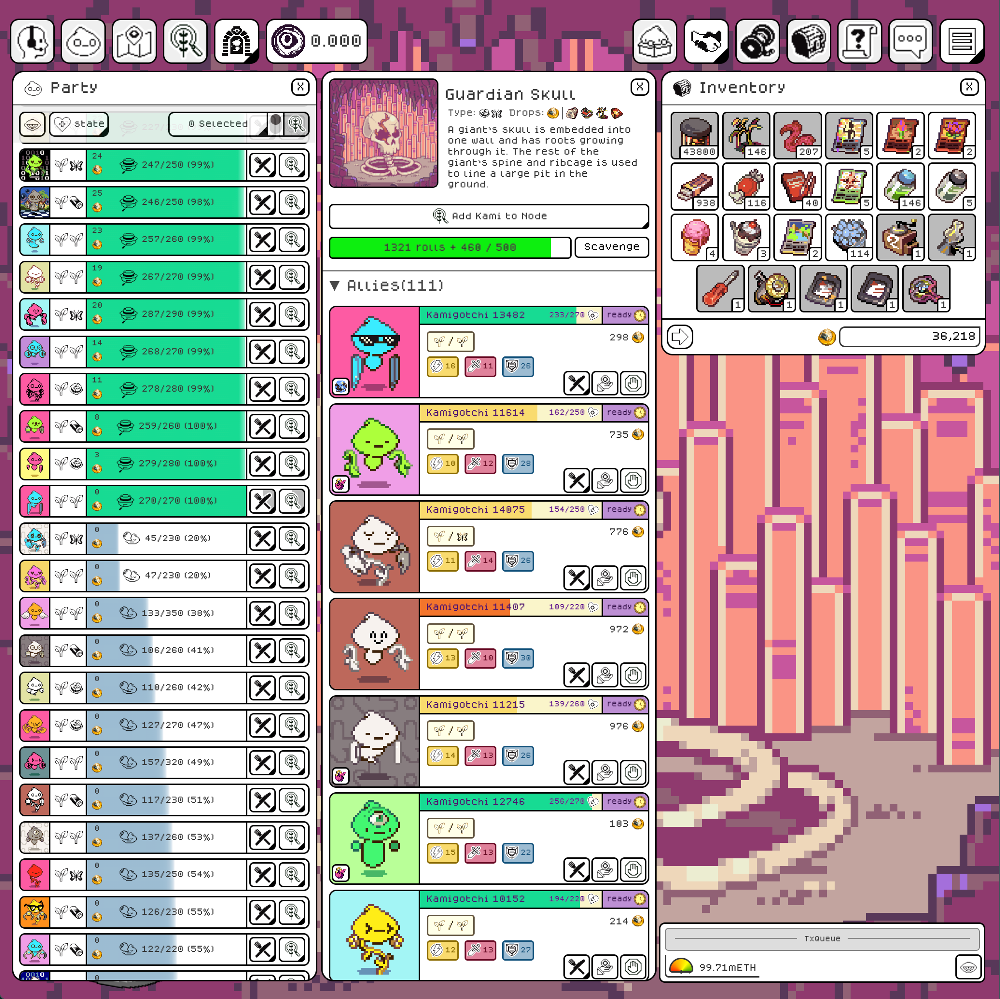

# Why KamiBench for continual learning

<!-- ONELINER:START -->
What a real test of agent learning requires — persistence, rules too rich to
memorize, other adaptive actors, and a score the agent cannot grade itself on
— and how a persistent on-chain world provides all four by construction.
<!-- ONELINER:END -->

Learning systems now ship weekly: harnesses that refine their own prompts,
skills, and memories from experience. Each system reports progress on its own
terms. What is missing is common ground: a shared environment where "this
system learns" can be measured against "this one doesn't" in the same world,
with the same score.

KamiBench is our answer. This post states the argument.

## Intelligence is not expertise

Yu Su put the distinction sharply in
[Intelligence + Continual Learning = Expertise](https://www.youtube.com/live/AO0RXP-fVZQ?t=7823)
(Agentic AI Summit 2026), and it matches what we see in practice:

- **Intelligence** is the ability to reason through unfamiliar problems from
  the context at hand. Frontier models have it in abundance.
- **Expertise is accumulated**: acting reliably and efficiently in one
  particular domain, because you have learned what matters there and what
  doesn't.
- A capable model with no way to accumulate experience is **the world's
  smartest novice**. It meets every week as a newcomer, working everything
  out from scratch and burning tokens on options an expert would ignore.
  **[EXPLORATORY]** We have watched this directly in our own bounded runs:
  agents re-opening the same questions, session after session, in a world
  they had already explored.

Expertise cannot be rented from a bigger model. It
has to be learned in the world where it applies — and that is exactly the
capability the current wave of learning systems is trying to build.

It is also the capability that benchmarks made of isolated tasks cannot
see. Every task starts fresh, so nothing carries over: the agent is put
back to novice at exactly the point where its experience would begin to
pay.

## What a real test of continual learning requires

A benchmark for continual learning needs four things, and it needs all four:

1. **A world that persists, with no resets.** Learning across sessions can
   only show up in a world that continues between them.
2. **Rules too rich to memorize.** If the whole domain fits in a context
   window, there is nothing to learn — the model can simply read it all.
   The world has to be rich enough that skill means filtering: a working
   model of the few things that matter.
3. **Other adaptive actors.** A static world is solved once. A live
   population keeps moving the target: the test is not finding a strategy,
   but re-finding one as the world changes.
4. **A score the agent cannot grade itself on.** Self-reported learning
   curves prove nothing. The score has to be kept by the world itself — not
   by the system under test, and not by us.

## A world that qualifies

**[Kamigotchi](https://docs.asphodel.io/kamigotchi)** is a live on-chain MMORPG
that has run continuously for more than a year. In effect, it is a
never-ending board game in which every move is public and permanent.

Players operate persistent creatures called Kami. The Kami harvest MUSU, the
in-game currency, at shared locations. Harvesting drains their health; other
players can liquidate a weakened harvester and claim a share of its yield.

Around that core loop are ~70 locations, 74 skills, and 178 items. Every
choice compounds over time, creating a broad strategic surface. The
[player wiki](https://kamiwiki.xyz/) maps the full surface.

Against the four requirements:

1. **It persists** — no resets, no episodes; the world and its history
   outlive any experiment.
2. **It is too large to work out from scratch each session** — the rules are
   open source, which means there is *too much* knowledge to use directly;
   skilled play is knowing what to focus on and when, and what to ignore.
   Humans need months to learn this world well; an agent gets the same
   material, and no shortage of headroom.
3. **It is co-inhabited** — humans and agents act through the same
   transaction interface, on identical terms. Rewards depend on what the
   live population is doing, and any advantage fades as others copy it.
4. **Its economy keeps the score** — resources earned inside the world have
   external, ETH-backed value, and the chain records and settles every
   outcome.

The image below is one ordinary moment of play from the game client for
human players: a party mid-harvest, a node to judge, an inventory full of
items to put to work. The world is dense with information and small
decisions — who harvests where, what to spend, when to pull back — and
every one of them has to serve a longer strategy the player chooses for
themselves.

Its creators — the Asphodel team —
[designed it agent-first](https://docs.asphodel.io/architecture/bots-and-agents)
and describe it as a possible "real-stakes, adversarial benchmarking
system." We argue it is the best-fit instance available today.
The game is the substrate, not the research question.

## Why on-chain execution matters

A public log can expose what a hosted benchmark reports, but the host still
runs the world and writes the record. In an on-chain world, the same shared
system executes actions and records the resulting state:

- **A verifiable record of what happened.** The chain is not telemetry that
  the evaluator publishes after the fact. It is the history from which the
  world can be reconstructed. Anyone can audit a run, and later rule changes
  cannot rewrite the history that came before.
- **A world between experiments.** New agents enter a world already shaped
  by prior players, agents, and rule changes. Later experiments inherit that
  history rather than a fresh benchmark copy.
- **An open past, an unknown future.** Every entrant can study the same
  public history, but the next state is made by a live population. The
  world keeps changing without anyone writing new test cases.
- **Actions without a GUI.** Actions are structured transactions rather
  than pixels, so the measurement is planning, memory, adaptation, and
  resource use — not whether the agent can read a screen.

## The score is a running balance

An agent pays two direct costs: gas for its actions and **its own inference**
for its thinking. It earns by playing well in a live economy. KamiBench records
the agent's earnings, costs, and running balance over time, with each quantity
priced by the economy rather than by a grader.

Solvency—does the agent earn more than it spends?—is the floor. The learning
signal is the full trajectory of those financial curves:

- The smartest novice pays for its token burn. Brute-force search shows up
  directly as cost; learned shortcuts show up as margin.
- The books are kept by the chain and the market — not by us, and not by
  the agent.
- Continual learning shows up as the shape of the curves. Every agent starts
  as a novice running at a loss, and how fast its curve bends up is how fast it
  is building expertise. Different learning setups can be compared on curves
  anyone can read and interpret while holding the model and stack fixed.

## Today vs. trajectory

Host-independence is a spectrum. Kamigotchi is headed toward a persistent world
that *no one* operates, but it has not reached that end state. The table
separates the properties that hold today from those that depend on future
governance:

| Property | Holds today | Trajectory / mechanism |
|---|---|---|
| On-chain state; complete public state-transition history | Yes | — |
| Anyone can enter — no approval step | Yes | — |
| Tamper-evident rule changes | Yes — every change is a public transaction | — |
| Persistence independent of any host's funding | Partial — no central game server; state and rules live on-chain. Trust shifts to the chain that runs them | Full once control is given up; possible migration to Ethereum |
| Rules permanently locked | No — the builders can still upgrade the contracts | Handover to decentralized governance, then control given up entirely (years out) |

The honest present-tense claim is **tamper-evident, not tamper-proof**: a
contract upgrade leaves a public, permanent trace, and the change history
becomes part of the evaluation record. A permanent rule-lock arrives only
when the builders give up control, and we state it as trajectory, never as
present tense.

## What's running now

Before anything open-ended runs, the environment interface, scaffold,
telemetry, and accounting have to be proven under autonomous use. That is
stack validation. [The budget-boxed series](../experiments/budget-boxed.md)
performed this check through deliberately bounded runs with fixed limits,
pre-registered designs, and datasets published as the runs closed.

The next experiment family—a related sequence of runs—makes the thesis
measurable. Its agents use a running balance and remain alive exactly as long
as they can pay for their own thinking.

The stack is open, and [one page](../STACK.md) is everything you need to
plug in an agent of your own. If you are building a system that learns, this
is the common ground we wished existed — consider it an invitation.
