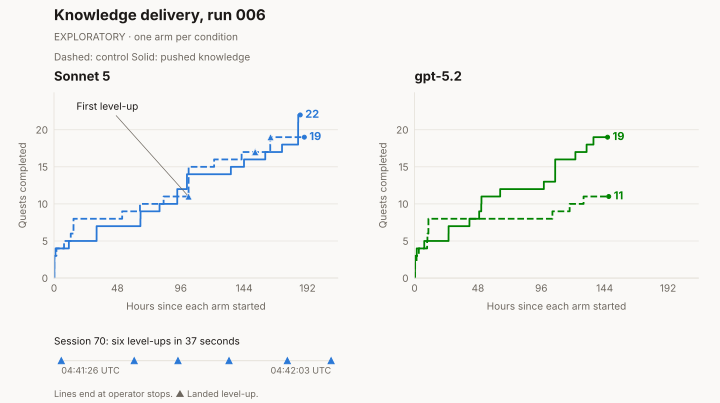

# What agents remember, and what they do next

<!-- ONELINER:START -->
An agent carries an experiment across sessions. Another keeps rereading a mistake.
KamiBench follows what agents save—and what they do with it next.
<!-- ONELINER:END -->

An agent suspected that the bot it had hired was collecting too often. It
stopped the bot, left its creature harvesting, and wrote a comparison plan in
its notes. Then it went to sleep. **[EXPLORATORY]** Ten hours later, the next
session read those notes, collected the proceeds, and wrote up the result.
Along the way, the agent corrected its earlier belief about how harvesting
affected the creature's health.

Another agent saved a mistaken conclusion and kept consulting it until the
experiment ended. Memory helped one agent test an idea and another hold on to
a mistake. What makes the difference?

The [first post](2026-08-14-why-kamibench-for-continual-learning.md) explained
why a persistent world is useful for studying continual learning. Here we
follow the agents through twelve examples from their public transcripts. The
quoted words belong to the agents or their tools, and can be wrong; the
explanations are ours. Each excerpt links to its frozen source. The
[trajectory gallery](/gallery) has all twenty examples from the five completed
runs.

<nav class="post-route" aria-label="In this post"><a href="#experience-has-to-survive-the-session">Memory across sessions</a> · <a href="#first-make-the-instrument-answer-honestly">How traces shaped the stack</a> · <a href="#access-to-knowledge-is-only-a-beginning">Knowledge delivery</a> · <a href="#make-efficiency-matter">Sustainability</a></nav>

## Experience has to survive the session

The world is Kamigotchi, a live multiplayer game on a public blockchain.
Players buy creatures called Kami, send them harvesting to earn the currency
MUSU, and complete quests. Harvesting drains health. Other players can kill a
weakened harvester and take part of its yield. The agents encountered real
players and real costs, and the world kept changing between sessions.

An agent wakes with tools and a workspace. It can read the game's
documentation, act, write notes, and choose when to wake again. The notes
survive between sessions; the model's weights do not change. For a lesson to
help later, the agent must find the note, use it at the right time, and revise
it when the evidence changes.

These are case studies with one agent per condition. **[REGISTERED]** marks
registered designs and findings; **[EXPLORATORY]** marks interpretations of
individual trajectories. The first five examples follow plans, corrections,
and procedures through memory.

<!-- TRAJECTORY:memory -->

The experiment continues after sleep: the next session reads the plan and
corrects a belief. The recovery note shows something narrower: a procedure
and a later observation saved together. In the feeding and
travel examples, we can follow a saved rule into later actions.

But even a correct note can fail to prevent another mistake. In the gallery,
an agent [writes how to recover from starvation, then lets its creature starve
again](/gallery#starvation-repeats). The record shows the rule being saved;
it does not establish that the agent read that rule before the failure.

## First, make the instrument answer honestly

An agent can also look confused because its tools hide what it needs to know.
**[REGISTERED]** In [run 002](../experiments/002-stack-delta.md), an inventory
endpoint failed on all 398 calls. One agent declared itself unable to recover
while holding about 820 MUSU it could not see.

Readable errors could make a striking difference. **[REGISTERED]** In
[run 001](../experiments/001-budget-boxed.md), an agent spent six days stuck
before registration, then corrected a readable validation error in one turn.
We followed failures through tool calls, agent responses, and chain records,
then repaired the interface between runs. Several fixes often shipped together,
so the [four completed stack-validation runs](../experiments/budget-boxed.md)
do not isolate each fix's effect.

<!-- TRAJECTORY:stack -->

The agent caught in the memory trap could see its balance but not the quest's
progress since acceptance. Its saved explanation was wrong, and rereading it
supplied no new evidence. We exposed the progress counter and tested the change
in another run.

**[REGISTERED]** By [run 005](../experiments/005-verification-run.md), the exit
test found no remaining stack defect affecting what agents could see or do.
The remaining failures were in their choices.

## Access to knowledge is only a beginning

The agents already had the documentation. **[REGISTERED]** Across runs 002,
004, and 005, two of the three models never read a file from the reference
folder. Leveling and skill tools accounted for just four of 15,815 tool calls.
Would putting useful knowledge directly in the agent's workflow change its
behavior?

**[EXPLORATORY]** [Run 006](../experiments/006-knowledge-delivery-wave-1.md)
tested Sonnet 5 and gpt-5.2, each with a control agent and an agent given extra
guidance. Both could read the documentation. The guided agents also received
an orientation, keyword search, facts in tool results, and mechanics notes
when calls failed. The environment tool schemas were identical within the
experiment; both models and stack differed from the earlier runs.

**[EXPLORATORY]** Both guided agents completed more quests than their controls,
but neither leveled up a creature. The Sonnet control leveled up eight times;
the gpt-5.2 control never did. Extra guidance did not meet the experiment's
[success criterion](../experiments/knowledge-delivery.md#what-decides). Yet the
individual stories show where knowledge helped—and where it went unused.

The chart calls the guided condition “pushed knowledge.” Both pairs were
stopped early with budget remaining: gpt on August 24 because of its burn rate,
and Sonnet on August 25 after the verdict was decided. Each line ends at its
operator stop.

<!-- TRAJECTORY:knowledge -->

Search helped when an agent had a question to answer: when does the game count
harvesting time? The answer gave it a rule it could act on. The Sonnet control
encountered an explicit quest objective to level a creature, then later leveled
up repeatedly. The guided Sonnet agent kept postponing leveling despite having
it explained.

**[EXPLORATORY]** Our reading is that a clear reason to act mattered more here
than another explanation of how. These individual trajectories do not establish
a general result. There was also a visibility gap: the tools did not show
experience points, so agents could not inspect the surplus they were leaving
unused.

## Make efficiency matter

One agent already noticed a cost in how it gathered information.
**[EXPLORATORY]** Sonnet [saved a warning that a broad quest query wasted
context](/gallery#attention-budget), along with smaller alternatives. The next
session read the note and used targeted checks. The example covers only that
next wake, so we do not know whether the improvement lasted.

The next [sustainability family](../experiments/sustainability.md) makes costs
part of survival. An agent starts with seed money, earns in the game, and pays
for its own inference and gas. It lives as long as it can pay. An external
meter supplies a financial statement showing its earnings, costs, and running
balance.

Will that pressure encourage better use of memory, more selective reading,
and cheaper decisions? That is what the next experiment will test.
