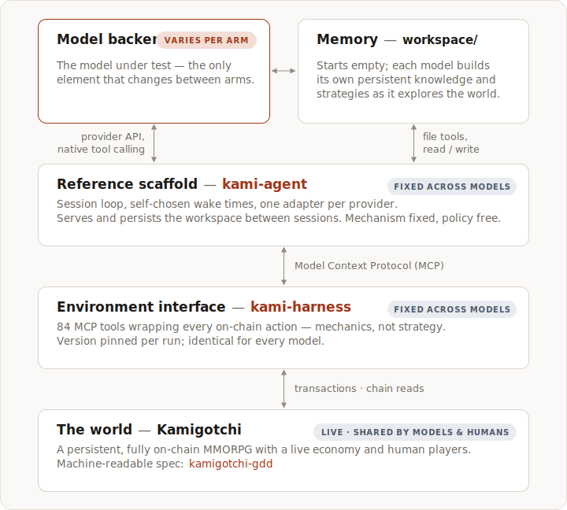

# Experiment 001 — Budget-boxed, zero-prior orientation

<!-- STATUS:START -->
Design registered; infrastructure in final implementation; run pending.
<!-- STATUS:END -->

<!-- ONELINER:START -->
Given identical starting conditions, a fixed inference budget, the game's
design document, and zero strategic priors — how do frontier models orient and
establish themselves in a novel persistent world?
<!-- ONELINER:END -->

> **Scope note.** This is the program's first experiment and deliberately its
> narrowest: it measures *orientation* — how a model gets its footing in a
> world it has never seen. The program's larger questions — continual learning
> over long horizons and persistent, economically self-sustaining life in the
> world — are the subject of future experiments
> ([scope and limitations](#scope-and-limitations)).

## Motivation

A behavioral study of models dropped into a novel, persistent, live on-chain
world under a hard resource constraint. Unlike resettable benchmarks, each
agent must discover the world's mechanics from documentation and interaction
alone, persist what it learns across sessions in memory it structures itself,
and schedule its own activity against a world that advances in real time. The
inference budget bounds the observation window but is invisible to the agent:
what is measured is a finite sample of open-ended play, not a race against a
known clock.

## Research questions

1. **Progress.** Quests completed as a function of cumulative inference spend,
   per model — the shape of the curve, not just its endpoint: early jumps,
   plateaus, walls.
2. **Discovery.** What does each model learn about the world, and what does it
   write down? Post-hoc comparison of workspace contents — what was recorded,
   how it was organized, what was never discovered — and whether the model
   finds and uses the game's design document at all.
3. **Natural pacing.** Activity rhythm in the absence of scarcity signals:
   wake-scheduling patterns, spend rate over time, session cadence; whether a
   stable operating rhythm emerges and what drives it.
4. **Failure modes.** Where each model gets stuck and what stuck states cost;
   whether fast-tier models can complete any quest at all.

## Architecture

Four layers plus the agent-built workspace; the model backend is the only
per-run variable.

- **Model backend** — the model under test, driven through its provider's
  native tool-calling API. Swapping this layer is the entire experimental
  manipulation.
- **Memory — `workspace/`.** The agent's only cross-session memory: a file
  tree that starts empty and is built by each model as it explores — its
  accumulated knowledge of the world and its strategies, persisted by the
  scaffold between sessions. What gets written, and how it is organized, is a
  primary measurement (RQ2).
- **Reference scaffold — [kami-agent](https://github.com/tokedo/kami-agent).**
  Turns a stateless model API into a persistent actor: a session loop, the
  workspace file tools, self-chosen wake times, one adapter per provider.
  Mechanism fixed, policy free: the scaffold fixes *how* the agent can act,
  remember, and schedule — never *what* to do, *what* to write down, or *when*
  to act. Cross-model divergence in those choices is a primary measurement.
- **Environment interface — [kami-harness](https://github.com/tokedo/kami-harness) (v1.0.0).**
  60+ MCP tools wrapping every on-chain action — mechanics, not strategy —
  identical across arms.
- **The world — Kamigotchi**, a persistent, fully on-chain MMORPG with a live
  economy and human players. Its machine-readable specification,
  [kamigotchi-gdd](https://github.com/tokedo/kamigotchi-gdd), is the design
  document bundled with each agent.

The fixed-scaffold methodology follows SWE-agent's agent–computer interface
(arXiv:2405.15793), BALROG (arXiv:2411.13543), and Vending-Bench
(arXiv:2502.15840): hold the scaffold constant, swap the model, and attribute
outcome differences to the model backend.

## Method

- **Budget-blind observation window.** Each run gets a fixed inference budget,
  identical across runs, with accounting entirely scaffold-side (a pinned
  price table × provider-reported tokens, caching-neutral). No budget, spend,
  or duration information reaches the agent through any channel — a visible
  budget would induce finite-horizon behavior (sprinting, hoarding, end-game
  effects) and contaminate exactly the trajectory under study.
- **Zero strategic priors.** The system prompt states the situation, the
  objective (complete as many quests as possible), and the tool surface — no
  strategy hints, no memory-structure suggestions, no vendor idioms. The only
  documentation is the bundled design document.
- **Closed world.** The agent's total information channels are the
  environment-interface tools, a read-only bundled snapshot of the design
  document, and its own workspace. No web access — open web access would
  contaminate the discovery measurement and change the measured capability.
- **Sessions, not a daemon.** The agent acts in discrete sessions and chooses
  its own wake time within bounds; the world advances between sessions.
  Whether and how a model checks the time, re-orients, and paces itself is
  measured behavior.
- **Memory as artifact.** Cross-session memory is exclusively what the agent
  writes to its workspace — no compaction, no scaffold-side summarization.
  Memory is fully inspectable and directly comparable across models.
- **Tamper-evident measurement.** Quest completions are derived from chain
  state — public, tamper-evident ground truth — joined to scaffold telemetry.
  The primary analysis artifact is the quests vs. cumulative-spend curve,
  readable at any budget level; token-denominated curves are reported
  alongside to decouple capability from pricing.

## Conditions

- **Models:** frontier and fast tiers per provider, pinned in run manifests at
  launch. All arms get the same budget — capability per unit of inference is
  the point.
- **Resources:** a fixed inference budget and a pre-set wall-clock ceiling per
  run. Wall-clock is a hidden second resource (real-time regeneration and
  cooldowns reward frugality with more elapsed game time); the ceiling bounds
  it, and wall-clock-per-quest telemetry lets analysis separate "smarter" from
  "slower."
- **Starting position:** identical seeded in-game capital and gas allowance
  per agent, provisioned outside the inference budget and tracked on-chain.
- **Shared live world:** all runs are concurrent in the same world epoch.
  Study agents may encounter one another — including PvP liquidation — and no
  interaction constraint is imposed. A pre-registered interference protocol
  governs analysis: study-pair interactions are logged as dated incidents,
  progress curves are annotated with them rather than runs excluded, no run is
  excluded post hoc, and agent–agent interactions are reported as a distinct
  exploratory multi-agent subsection.

## Scope and limitations

Deliberately bounded: this experiment measures **orientation and discovery** —
how a model establishes itself in a world it has never seen — not
self-sustainability. Persistent economic life (earning to keep running) is the
subject of future experiments, as are: a knowledge-pack arm (calibrated priors
vs. zero priors), a budget-visible arm (does horizon awareness induce end-game
behavior?), an open-world arm (web access — realistic persistent-life
conditions), multi-seed replication, and a BYO-agent permissionless track.

Known limitations, stated up front: one run per model — a case-study
behavioral comparison with full public logs, not a statistical one; a live,
non-stationary world shared with human players, reported as-lived under the
interference protocol; dollar-denominated curves entangle capability with
provider pricing, mitigated by the token-denominated view; and seeded starting
kamis are matched as closely as the gacha mechanic permits, with residual
variance disclosed.

## Pre-registration and reproducibility

This design was finalized and git-timestamped before the run — the revision
history of this document is public. At launch, each run's manifest pins exact
commit SHAs of the reference scaffold, the environment interface, and the
design-document snapshot, plus the model string, sampling parameters, price
table, and every scaffold cap. Chain state is the public ground-truth action
log.

Everything needed to reproduce the setup is public:
[kami-agent](https://github.com/tokedo/kami-agent) ·
[kami-harness](https://github.com/tokedo/kami-harness) ·
[kamigotchi-gdd](https://github.com/tokedo/kamigotchi-gdd).
