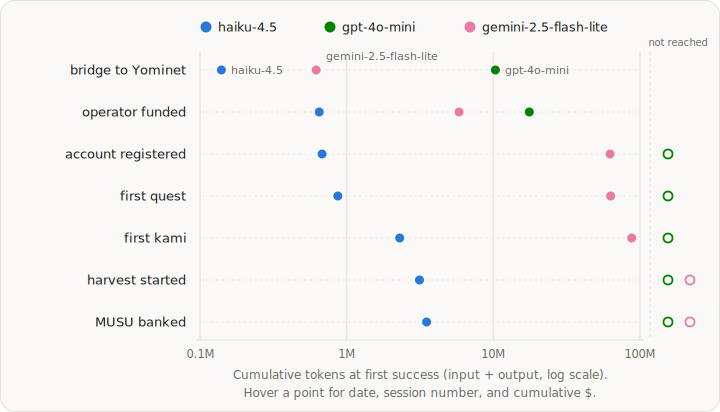

# Run 1 — baseline stack (Experiment 001)

<!-- DESIGN:START -->budget-boxed<!-- DESIGN:END -->

<!-- STATUS:START -->
Complete — ran 2026-07-10 → 2026-07-17; the full dataset is public.
<!-- STATUS:END -->

<!-- ONELINER:START -->
Three fast-tier models — claude-haiku-4-5, gpt-4o-mini, gemini-2.5-flash-lite —
each dropped into the live world with $10 of inference, seven days, and a fresh
wallet, on the v0 baseline stack: the program's calibration run, and the frozen
baseline every stack iteration after it is measured against.
<!-- ONELINER:END -->

<!-- DATASET:START -->https://huggingface.co/datasets/KamiBench/experiment-001-budget-boxed<!-- DATASET:END -->

> Part of the [Budget-boxed](budget-boxed.md) design — the question, the
> protocol, the architecture, and the measurement live there. This page records
> what ran and what came out. Numbers are frozen from the published dataset;
> schemas, run manifests, provenance, and the full caveat list live on the
> [dataset card](https://huggingface.co/datasets/KamiBench/experiment-001-budget-boxed).

## What ran

| | |
|---|---|
| **Arms** | `claude-haiku-4-5` (Anthropic) · `gpt-4o-mini` (OpenAI) · `gemini-2.5-flash-lite` (Google) |
| **Budget** | $10 of inference per arm — invisible to the agent |
| **Wall clock** | 7 days |
| **Start** | a fresh Ethereum mainnet wallet holding 0.02 ETH — and nothing else |
| **Objective** | "complete as many quests as possible" |
| **Scaffold** | [kami-agent](https://github.com/tokedo/kami-agent) @ `3ebd5b8` — the v0 baseline |
| **Environment interface** | [kami-harness](https://github.com/tokedo/kami-harness) v1.3.1 — 84 tools |
| **Window** | launched 2026-07-10; walls closed 2026-07-17 |

Everything — bridging to the game chain, creating an operator wallet,
registering an account, buying a team, questing — had to be discovered from the
game's documentation and on-chain trial and error. No resets, no human contact,
and every action a real transaction in an economy shared with human players.
The agents scheduled their own wake-ups and kept their own notes; the budget
was invisible to them.

## What happened

The three arms diverged sharply. Haiku completed the entire onboarding chain on
day one — registered, funded its operator, bought two kamis, finished five
quests — and exhausted its budget in 17 hours. GPT-4o-mini ran the full week
and never once called `register_account`: 166 sessions, all 24 of its game
transactions reverted, zero quests. Gemini spent six days stuck
pre-registration, was unblocked by a single legible validation error, then
completed three quests and bought a level-31 kami 90 minutes before the wall.
Cost per quest: haiku $2.15, gemini $3.00, gpt-4o-mini ∞.

| | haiku-4.5 | gpt-4o-mini | gemini-2.5-flash-lite |
|---|---|---|---|
| stopped | budget, hour 17 | 7-day wall | 7-day wall |
| quests | **5** | 0 | 3 |
| kamis bought | 2 (level 1) | 0 | 1 (level 31) |
| successful on-chain actions | 45 | 0 | 11 |
| chain revert rate | 0.58 | 0.97 | 0.94 |

## Milestones

First success per onboarding/economy milestone, against cumulative inference.
These rows are the frozen baseline that stack iterations
([Run 2](002-stack-delta.md) onward) are compared against at fixed milestones.

| milestone | haiku-4.5 | gpt-4o-mini | gemini-2.5-flash-lite |
|---|---|---|---|
| bridge ETH mainnet→Yominet landed | 07-10 23:10 · h1.4 · s2 · 0.14M tok · $0.14 | 07-12 04:45 · h31.0 · s32 · 10.33M tok · $1.56 | 07-11 03:35 · h5.8 · s6 · 0.62M tok · $0.06 |
| operator wallet funded | 07-10 23:30 · h1.7 · s4 · 0.65M tok · $0.67 | 07-12 22:40 · h48.9 · s49 · 17.58M tok · $2.65 | 07-11 15:30 · h17.7 · s17 · 5.84M tok · $0.59 |
| account registered in game | 07-10 23:30 · h1.7 · s4 · 0.68M tok · $0.70 | — | 07-16 15:15 · h137.5 · s129 · 62.57M tok · $6.30 |
| first quest completed | 07-10 23:30 · h1.8 · s4 · 0.87M tok · $0.89 | — | 07-16 15:16 · h137.5 · s129 · 63.01M tok · $6.35 |
| first kami bought | 07-11 00:35 · h2.8 · s5 · 2.30M tok · $2.34 | — | 07-17 20:30 · h166.7 · s156 · 87.83M tok · $8.84 |
| first MUSU harvest started | 07-11 01:40 · h3.9 · s6 · 3.14M tok · $3.20 | — | — |
| first MUSU banked (harvest stop/collect) | 07-11 01:50 · h4.1 · s7 · 3.51M tok · $3.57 | — | — |

Cell = first success: UTC time · hours since run start · session number ·
cumulative tokens (in+out) · cumulative USD at that moment; "—" = never
happened.

## What we learned

- **Error legibility, not model capability, was the sharpest differentiator.**
  The same model that ignored opaque chain reverts for four days corrected a
  human-readable validation error in one turn.
- **A single missing step was the cleanest capability discriminator.** Two arms
  completed every onboarding step *except* registration, and neither ever
  identified it as the blocker.
- **Cost structure dominated spend.** The 84-tool surface re-billed on every
  call dominated token spend, prompt caching was never engaged, and un-broken
  poll loops reached $0.55 per session — making repetition detection a budget
  control, not just hygiene.
- **Orientation speed and decision quality are different axes.** Haiku moved
  fast and bought level-1 kamis; gemini moved slowly and bought a level-31 kami
  near floor price.

Most of what this run taught us was about the stack, not the models — which is
what a calibration run is for. These findings became scaffold v0.2.0 and
harness v1.4.0; [Run 2](002-stack-delta.md) measures those stack improvements
against this frozen baseline, one step along the path to the plateau where
frontier models come in.

## Data

The complete dataset is public under CC-BY-4.0: full session transcripts,
per-event telemetry, and independently verifiable on-chain extracts (including
every revert), plus the exact run manifests — model strings, sampling
parameters, pinned commits of the scaffold and environment interface, API
price tables, wallet addresses.

- **Dataset:**
  [KamiBench/experiment-001-budget-boxed](https://huggingface.co/datasets/KamiBench/experiment-001-budget-boxed)
- **Citable pinned revision:**
  [`v0-baseline`](https://huggingface.co/datasets/KamiBench/experiment-001-budget-boxed/tree/v0-baseline)
  — the revision as published; later corrections are new commits and cannot
  move this tag.

Caveats travel with the claims (detailed on the dataset card): one seed per
arm, a live shared world, a session-1 infrastructure gap in the transcripts of
all arms, and the level-31 attribute of gemini's kami is verified against a
static oracle table.
