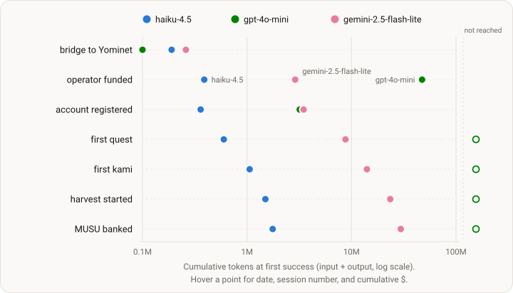

# Run 2 — iterated stack (Experiment 002)

<!-- DESIGN:START -->budget-boxed<!-- DESIGN:END -->

<!-- STATUS:START -->
Complete — ran 2026-07-19 → 2026-07-26; the full dataset is public.
<!-- STATUS:END -->

<!-- ONELINER:START -->
Same three models, same $10 / 7-day box — on the hardened stack (scaffold
v0.2.0, environment interface v1.5.1). At fixed model and budget, the delta
against Run 1's frozen baseline is what the stack changes bought: chain reverts
collapsed, every arm registered in-game, quests rose — and the binding
constraint moved from transactions to perception.
<!-- ONELINER:END -->

<!-- DATASET:START -->https://huggingface.co/datasets/KamiBench/experiment-002-budget-boxed<!-- DATASET:END -->

| | |
|---|---|
| **Status** | complete — the full dataset is public |
| **Arms** | identical to Run 1: `claude-haiku-4-5` · `gpt-4o-mini` · `gemini-2.5-flash-lite` |
| **The box** | $10 of inference per arm, cache-aware accounting (invisible to the agent) · 7-day wall clock · objective unchanged: "complete as many quests as possible" |
| **Stack** | [kami-agent](https://github.com/tokedo/kami-agent) v0.2.0 @ `18f75d04` · [kami-harness](https://github.com/tokedo/kami-harness) v1.5.1 @ `27592ce` — the same 84-tool v1.x surface |
| **Window** | launched 2026-07-19; walls closed 2026-07-26 |
| **Dataset** | [experiment-002-budget-boxed](https://huggingface.co/datasets/KamiBench/experiment-002-budget-boxed) · citable pinned revision [`v0-final`](https://huggingface.co/datasets/KamiBench/experiment-002-budget-boxed/tree/v0-final) |

## Goal

Hold the models fixed and change the stack — what do the improvements buy?
Between the runs, the environment interface gained legible pre-transaction
validation and the scaffold gained behavioral controls plus cache-aware budget
accounting — the changes [Run 1](001-budget-boxed.md)'s failures paid for,
measured here against Run 1's frozen baseline. Everything shared lives on the
[design page](budget-boxed.md).

## Outcome

The headline is the revert column: the same models that burned reverts at
rates of 0.58 / 0.97 / 0.94 in Run 1 produced 0.048 / 0.000 / 0.011 — the
validation gates convert almost every doomed transaction into a free, legible
error before gas is spent. **All three arms registered in-game** (gpt-4o-mini
never did in Run 1), quest output rose at fixed budget, and for two of three
arms the budget cap was no longer the binding constraint: they ran into the
wall clock with money left. Run 1 values in parentheses.

| | haiku-4.5 | gpt-4o-mini | gemini-2.5-flash-lite |
|---|---|---|---|
| stopped | budget $10.03, h112 | 7-day wall, $5.38 | 7-day wall, $2.04 |
| quests | **8** (5) | 0 (0) | 5 (3) |
| kamis bought | 3 (2) | 0 (0) | 3 (1) |
| real on-chain successes | 156 (45) | 19 (0) | 88 (11) |
| chain revert rate | 0.048 (0.575) | 0.000 (0.967) | 0.011 (0.943) |
| registered in-game | h0.4 (h1.7) | h8.4 (never) | h2.3 (h137.5) |
| usd per quest | 1.25 (2.15) | ∞ (∞) | 0.41 (3.00) |

## Milestones

First success per onboarding/economy milestone, against cumulative inference —
the same instrument as [Run 1](001-budget-boxed.md#milestones), so the rows
compare directly. The full milestone table is on the [dataset card](https://huggingface.co/datasets/KamiBench/experiment-002-budget-boxed).

## Key learnings

- **Legible errors fix transactions, not beliefs** — with transaction wastage largely fixed, the binding constraint moved up a level, to perception, and agents acted confidently on unverifiable or wrong world-state.
- **Three arms, three world-model failures around one blind spot** — a run-lifetime inventory-endpoint outage produced a *false* world model (haiku), *no* world model (gpt-4o-mini), and a *wrong* world model (gemini).
- **Perception parity became a first-class surface requirement** — no longer a property assumed of the world.
- **A verb→mechanic ambiguity cost gemini its team** — the sacrifice≠liquidate confusion produced a disambiguation patch in the next environment-interface version.
- **Two structural gaps produced structural fixes** — explicit three-state transaction reporting, and a pre-run availability gate for the delegation layer.

## Full detail

The full run report — the narrative, the complete milestone table, the three
failure patterns in full, the stack changes this run produced, the honest
limits, schemas, run manifests, and provenance — lives on the
[dataset card](https://huggingface.co/datasets/KamiBench/experiment-002-budget-boxed).
The version of this page registered before launch — research questions and
directional expectations, git-timestamped 2026-07-19 — is preserved in this
repository's history.
