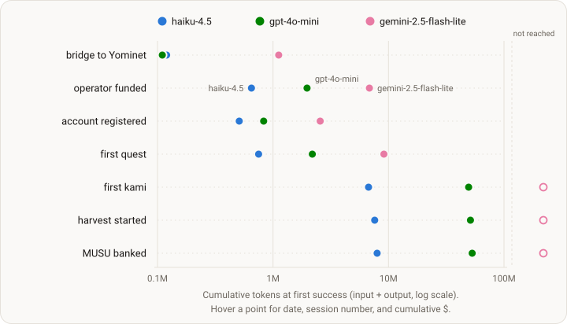

# Run 4 — perception parity re-run (Experiment 004)

<!-- DESIGN:START -->budget-boxed<!-- DESIGN:END -->

<!-- STATUS:START -->
Complete — ran 2026-07-28 → 2026-08-05; the full dataset is public.
<!-- STATUS:END -->

<!-- ONELINER:START -->
Same three models, same $10 / 7-day box, same objective text — the clean
re-run of Run 3's pre-registered design on the identical perception-parity
pins (environment interface v2.0.0, 99 tools, lens-backed reads; scaffold
v0.3.2), and the E2 baseline for the series. The stack held: zero perception
outages, zero kamis lost, write waste at the floor — and the binding
constraint moved again, from perception to omission and belief.
<!-- ONELINER:END -->

<!-- DATASET:START -->https://huggingface.co/datasets/KamiBench/experiment-004-budget-boxed<!-- DATASET:END -->

| | |
|---|---|
| **Status** | complete — the full dataset is public |
| **Design** | carry-over of [Run 3](003-perception-parity.md)'s pre-registered design, verbatim — identical pins, fresh cohort; series results exclude Run 3 |
| **Arms** | identical to Runs 1–3: `claude-haiku-4-5` · `gpt-4o-mini` · `gemini-2.5-flash-lite` |
| **The box** | $10 of inference per arm, cache-aware accounting (invisible to the agent) · 7-day wall clock · objective verbatim from Run 2: "complete as many quests as possible" |
| **Stack** | [kami-harness](https://github.com/tokedo/kami-harness) v2.0.0 — 99 tools, lens-backed reads · [kami-agent](https://github.com/tokedo/kami-agent) v0.3.2 — the perception-parity (E2) stack |
| **Window** | launched 2026-07-28; walls closed 2026-08-05 |
| **Dataset** | [experiment-004-budget-boxed](https://huggingface.co/datasets/KamiBench/experiment-004-budget-boxed) · citable pinned revision [`v0-final`](https://huggingface.co/datasets/KamiBench/experiment-004-budget-boxed/tree/v0-final) |

## Goal

[Run 2](002-stack-delta.md)'s death spirals traced to missing or incorrect
world state — to perception, not judgment. [Run 3](003-perception-parity.md) was
the first attempt to test the resulting E2 stack, but a tooling defect retired
that run before its environment ever ran. Run 4 repeated the identical
pre-registered design and pins with a fresh cohort, becoming the series' first
completed run on E2.

On the E2 stack, world-state reads are lens-backed and confirmed reverts are
raised as tool errors. The stack also makes liquidation expressible and
distinguishes sacrifice from liquidate. Models, budget, box, and objective text
are unchanged from Run 2. The difference between Runs 2 and 4 is therefore an
environment-change measurement, and Run 4's numbers stand as the E2 baseline.
Everything shared lives on the [design page](budget-boxed.md).

## Outcome

All three arms ran to the 7-day wall with money still in the box. There was no
budget stop and no kami was lost; the arms spent $16.97 of the $30 envelope.
The legible pre-transaction gates stopped **638 doomed write attempts**, while
**6 landed transactions reverted** across the run (Run 2: 331 blocked attempts
and 9 landed reverts). Every arm registered in-game inside 3.5 hours.

gpt-4o-mini completed 7 quests, compared with 0 in Run 2. It also bought a
kami and landed 317 on-chain transactions. Run 2's spectator behavior did not
recur.

Lens-backed reads served every world-state query with zero unavailability and
zero restarts across 7 d 19 h. Cost accounting came out exact on every arm.
Run 2 values appear in parentheses.

| | haiku-4.5 | gpt-4o-mini | gemini-2.5-flash-lite |
|---|---|---|---|
| stopped | 7-day wall, $8.95 (budget $10.03, h112) | 7-day wall, $6.48 ($5.38) | 7-day wall, $1.54 ($2.04) |
| quests | 5 (**8**) | **7** (0) | 2 (5) |
| kamis bought | 1 (3) | 1 (0) | 0 (3) |
| chain revert rate | 0.024 (0.048) | 0.012 (0.000) | 0.000 (0.011) |
| registered in-game | h0.4 (h0.4) | h1.5 (h8.4) | h3.4 (h2.3) |
| usd per quest | 1.79 (1.25) | 0.93 (∞) | 0.77 (0.41) |

## Milestones

First success per onboarding/economy milestone, against cumulative inference —
the same instrument as [Run 1](001-budget-boxed.md#milestones) and
[Run 2](002-stack-delta.md#milestones), so the rows compare directly. The full
milestone table is on the [dataset card](https://huggingface.co/datasets/KamiBench/experiment-004-budget-boxed).

## Pre-registered expectations, scored

Directional, registered before launch; a miss is a result, not a failure of
the run.

1. **Misleading-surface death-configuration entries = 0** — **met**: zero kills across the run.
2. **Mechanic substitution on the liquidate quest = 0** — **met**, with the disclosure that no arm attempted the liquidate mechanic on-chain at all; Run 2's substitution arc did not recur.
3. **Silent false-success arcs = 0 by construction** — **met**. The diagnose half **missed**: agents attended every raised revert, but the revert-reason channel proved unusable in all 6 instances — a concrete interface finding, fixed in the next version.
4. **Zero perception-outage arcs** — **met**.
5. **Delegation: ≥1 arm completes escrow → running strategy** — **met**: one arm completed the escrow → running-strategy path.
6. **Quests per arm ≥ Run 2's** — **one of three**: gpt-4o-mini 7 vs 0; haiku 5 vs 8; gemini 2 vs 5. The misses have mechanisms — belief dormancy, and a single never-retried funding-blocked attempt.

## The series-exit criterion

Pre-registered on this page and binding: the series closes after Run 4 only if
**all** hold — zero new structural-impossibility classes; zero
misleading-surface loss arcs; telemetry ↔ chain reconciliation 1:1 in both
directions; no new single-point-of-failure perception-outage class; lifecycle
clean, every stop a graceful wake-time check.

**All five held as written — and we registered a verification run anyway.**
Several limits qualify what those checks cover. They score *attempted*
behaviour only, and the arms attempted a narrow slice of the 99-tool surface:
160 tool-arm cells were never attempted at all. The run's largest behavioural
loss came from a surface-**omission** class outside the checks.

A reproducible write-path defect also traveled the whole series undiagnosed:
`harvest_collect` produced 12 on-chain reverts in 12 attempts across two runs.
Only after Run 4 was the defect traced to a gas ceiling below the action's real
cost and fixed in interface v2.1.0; the fix had not yet been proven in an
agent's hands.

[Run 5](005-verification-run.md) is that verification run, and carries its own
binding pre-registered exit test. A met-but-not-acted-on pre-registered
criterion, reported plainly, is the methodology working.

## Key learnings

- **Legible gates now absorb nearly all write waste** — 638 blocked attempts against 6 landed reverts.
- **A missing read left one arm dormant for 5.4 days with $1.05 unspent** — the arm held a false belief because the game client rendered a discriminating read that the pinned surface omitted. This moved the binding constraint from perception outage to omission and belief. The next perception-layer version added per-objective progress and per-account quest state.
- **The agent's workspace can cement a wrong belief** — 20+ re-reads of its own conclusion, zero re-tests; memory design is a live scaffold question.
- **The dominant failure mode is stopping, not deciding wrongly** — no arm had a fallback objective while the economy stayed open; the motivation for the program's solvency-objective family.
- **The one tool that never once succeeded on-chain** — `harvest_collect`, 12/12 reverts across two runs — was root-caused to a gas ceiling below the action's real cost, fixed in interface v2.1.0; [Run 5](005-verification-run.md) verifies it in agent hands.

## Full detail

The full run report — the narrative, the complete milestone table, the schemas,
the run manifests, and the provenance — lives on the
[dataset card](https://huggingface.co/datasets/KamiBench/experiment-004-budget-boxed).
The expectations and the series-exit criterion were pre-registered at
[Run 3](003-perception-parity.md)'s registration — git-timestamped 2026-07-27,
before either attempt launched — and carried verbatim; the running-card version
of this page is preserved in this repository's history.
