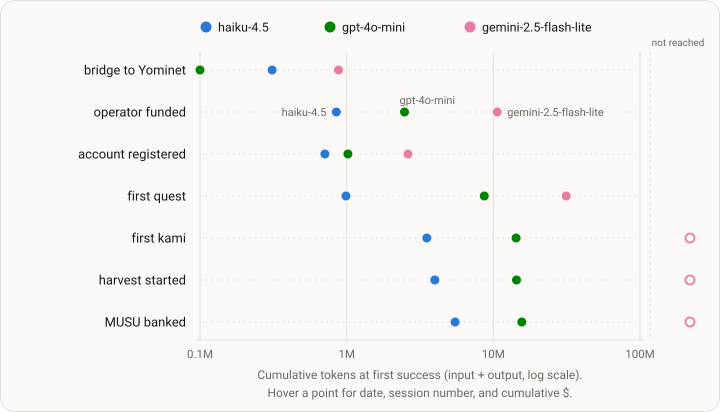

# Run 5 — verification run (Experiment 005)

<!-- DESIGN:START -->budget-boxed<!-- DESIGN:END -->

<!-- STATUS:START -->
Complete — ran 2026-08-07 → 2026-08-14; the exit test passed and the series is
closed. The full dataset is public.
<!-- STATUS:END -->

<!-- ONELINER:START -->
Same three models, same $10 / 7-day box — the verification run that closed the
budget-boxed series. The fixes Run 4 paid for had to work in agent hands, under
a binding pre-registered exit test, while a cost meter rode in shadow. They
did: the never-succeeding collect action went 20-for-20 on-chain, the dormancy
class did not recur, the revert-reason channel was used to correct a failure
within one session, and the shadow meter agreed with the run's own accounting
to microdollars. Verdict: MINOR-FIXES — the series exits, the sustainability
family proceeds.
<!-- ONELINER:END -->

<!-- DATASET:START -->https://huggingface.co/datasets/KamiBench/experiment-005-budget-boxed<!-- DATASET:END -->

| | |
|---|---|
| **Status** | complete — exit test passed, series closed, dataset public |
| **Arms** | identical to Runs 1–4: `claude-haiku-4-5` · `gpt-4o-mini` · `gemini-2.5-flash-lite` |
| **The box** | $10 of inference per arm, cache-aware accounting (invisible to the agent) · 7-day wall clock · objective verbatim: "complete as many quests as possible" |
| **Stack** | [kami-harness](https://github.com/tokedo/kami-harness) v2.1.0 — 101 tools · [kami-lens](https://github.com/tokedo/kami-lens) v0.3.0 world-state reads · [kami-agent](https://github.com/tokedo/kami-agent) v0.4.0 · [kami-meter](https://github.com/tokedo/kami-meter) in shadow |
| **Window** | launched 2026-08-07 ≈21:05 UTC; walls closed 2026-08-14 |
| **Dataset** | [experiment-005-budget-boxed](https://huggingface.co/datasets/KamiBench/experiment-005-budget-boxed) · citable pinned revision [`v0-final`](https://huggingface.co/datasets/KamiBench/experiment-005-budget-boxed/tree/v0-final) — includes the two shadow-meter ledgers as a first-class artifact |

## Goal

One question: **did the fixes land in agent hands?**
[Run 4](004-perception-parity-rerun.md) met every check of the pre-registered
series-exit criterion but also produced three concrete defects. The collect
action had never succeeded on-chain, a surface omission cost an arm most of a
week, and the revert-reason channel was unusable every time it was raised.

This run's pinned stack contained a fix for each defect. None of the fixes had
been demonstrated by an agent that did not know the fix existed. Run 5 was the
gate between the [budget-boxed series](budget-boxed.md) and the program's
sustainability family. It earned the exit.

## Outcome

Run 5 produced the first budget stop since Run 2. haiku-4.5 hit the $10 cap at
hour 154 and stopped gracefully 13.5 hours before the wall, while the other two
arms ran to the 7-day wall.

Before the fix, the collect action had produced 0 successes in 15 attempts
across the series. In Run 5, the repaired action recorded **36 attempts, 20
on-chain, 0 reverts**, with every receipt inside the repaired gas band.

The arms also found their first kami sooner on the richer surface: hour 3.1
for haiku, compared with 12.7 in Run 4, and hour 25.2 for gpt-4o-mini,
compared with 99.2. The result was a collapse in route-discovery time.

The run's own cost accounting came out exact on every arm. The shadow meter
computed spend independently from provider usage records, using dedicated
credentials for each arm. On both arms whose providers expose a usage API, the
meter agreed with the run's accounting within **4–6 millionths of a dollar**.
Run 4 values appear in parentheses.

| | haiku-4.5 | gpt-4o-mini | gemini-2.5-flash-lite |
|---|---|---|---|
| stopped | **budget $10.02, h154** (7-day wall, $8.95) | 7-day wall, $6.10 ($6.48) | 7-day wall, $1.08 ($1.54) |
| quests | **9** (5) | 7 (7) | 2 (2) |
| kamis bought | 1 (1) | 1 (1) | 0 (0) |
| chain revert rate | 0.000 (0.024) | 0.004 (0.012) | 0.000 (0.000) |
| registered in-game | h0.9 (h0.4) | h3.0 (h1.5) | h1.9 (h3.4) |
| usd per quest | 1.11 (1.79) | 0.87 (0.93) | 0.54 (0.77) |

## Milestones

First success per onboarding/economy milestone, against cumulative inference —
the same instrument as [Run 1](001-budget-boxed.md#milestones),
[Run 2](002-stack-delta.md#milestones) and
[Run 4](004-perception-parity-rerun.md#milestones), so the rows compare
directly. The full milestone table is on the
[dataset card](https://huggingface.co/datasets/KamiBench/experiment-005-budget-boxed).

## Pre-registered expectations, scored

Directional, registered before launch; a miss is a result, not a failure of
the run.

1. **The collect action succeeds on-chain in agent hands** — **met**: 36 attempts / 20 on-chain / 0 reverts across both kami-owning arms; every receipt inside the repaired gas band; largest single yield 639 MUSU.
2. **Zero dormancy-signature recurrence** — **met**: no arm stayed inactive ≥48 h on a belief a single available read contradicts. The progress counters Run 4's arm lacked were read and acted on — counters were observed advancing between reads on both kami-owning arms.
3. **The revert-reason channel is usable** — **met**: the run's only two on-chain reverts (one arm's "withdraw all" attempts) raised readable reasons, and the same session switched to explicit amounts and succeeded. Run 4's record was 0-for-6.
4. **Shadow-meter agreement within ±0.05% (with a $0.01 floor)** — **met** for both eligible arms: +3.95 and −5.70 millionths of a dollar against the run's own cache-aware accounting, on complete comparison windows, with dedicated per-arm provider credentials and a zero unpriceable-usage census. gemini disclosed ineligible (no cost API), as registered.
5. **The five Run 4 exit checks hold again** — **met**: zero new structural-impossibility classes, zero misleading-surface loss arcs, telemetry ↔ chain reconciliation 1:1 both directions, no new perception-outage class, lifecycle clean (every stop a graceful wake-time check).

**The exit test, scored as written: MINOR-FIXES.** Every queued fix is
protocol wording or lab-side tooling — nothing touches agent-visible surface
semantics or a measurement invariant. **The budget-boxed series is closed;
the sustainability family proceeds.**

## Key learnings

- **Verification runs earn their keep** — every fix was demonstrated by agents that did not know the fixes existed, which is a different standard than the fixes passing their own tests.
- **Delegation status did not match signing activity.** Run 4's delegated bot outlived the run. In Run 5, the delegation service reported RUNNING for containers that had stopped signing or had never signed at all, while the account-scoped strategy list was empty on all 45 queries across both enrolled arms. Every delegation decision made by either enrolled agent was blind, and service-side status was unreliable in both directions. By cycle-opener attribution, the LLM out-earned its own bot 2,121 vs 544 MUSU.
- **gemini-2.5-flash-lite never chose a fallback objective.** It spent $1.08 of $10 over 122 sessions, never acquired a kami, and ended 55 sessions by asking a question to a user who does not exist. This was the purest form of the stopping-not-deciding finding. No arm in four runs had a fallback objective while the economy stayed open — the motivation, now fully documented, for the sustainability family's solvency objective.
- **Measurement is ready for the family that needs it**: five closed comparison windows across the run, all inside tolerance by ~3 orders of magnitude; the meter's append-only ledgers replay hash-exact and ship in the dataset.

## Full detail

The full run report — narrative, complete milestone table, schemas, run
manifests, meter-ledger format, and provenance — lives on the
[dataset card](https://huggingface.co/datasets/KamiBench/experiment-005-budget-boxed).
Cohort identifiers were embargoed while the run was live and publish with the
dataset, the same practice as every run of this series; the running-card
version of this page is preserved in this repository's history. Everything
shared across the series lives on the [design page](budget-boxed.md).
