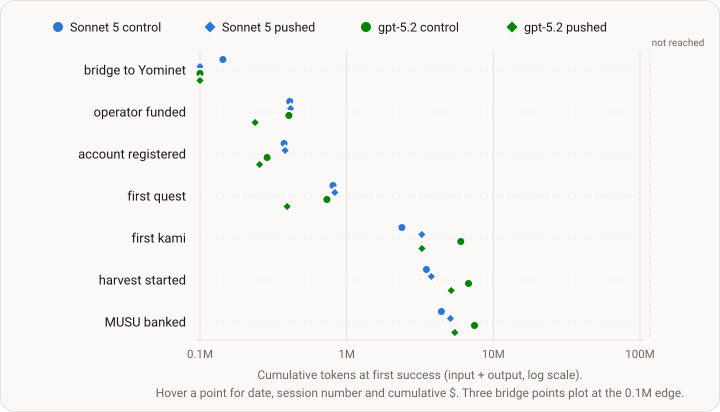

# Run 1 — knowledge delivery, wave 1 (Experiment 006)

<!-- DESIGN:START -->knowledge-delivery<!-- DESIGN:END -->

<!-- STATUS:START -->
Complete — stopped 2026-08-24 (gpt-5.2 arms) and 2026-08-25 (Sonnet 5 arms) by
operator ruling once the pre-registered verdict was decided; the family closes
at Wave 1 on its registered verdict. Dataset public at publication.
<!-- STATUS:END -->

<!-- ONELINER:START -->
The cheapest decisive test of the design: the control rung against the full
pushed-knowledge rung, on two mid-tier models, one arm per cell. It came back a
clean null. Both pushed arms matched or beat their own control on quests — 22
against 19 on Sonnet 5, 19 against 11 on gpt-5.2 — and neither landed a single
level-up, so the registered rule scores the pushed rung as not working on
either model, and the family's answer is "delivery is not the bottleneck at
this tier". The one arm that did level, eight times, to level 9, was the Sonnet
5 control — the arm with the least knowledge delivery of any, which found the
objective in a side quest that asked for it. Wave 2 and Wave 3 are not run; the
family closes here.
<!-- ONELINER:END -->

<!-- DATASET:START -->https://huggingface.co/datasets/KamiBench/experiment-006-knowledge-delivery<!-- DATASET:END -->

| | |
|---|---|
| **Status** | complete — verdict scored as registered, family closed at Wave 1, dataset public |
| **Arms** | `claude-sonnet-5` × {control, pushed} · `gpt-5.2` × {control, pushed} — one arm per cell |
| **Evidence tier** | EXPLORATORY — one arm per cell, no replication, both pairs stopped early. Pre-declared in the design, not a hedge added afterwards |
| **The box** | 150,000-token session cap · up to 14 days, early stop once an arm's verdict is clear · 0.03 ETH per arm · objective verbatim: "complete as many quests as possible" · $200-per-arm planning ceiling, invisible to the agent |
| **Reasoning** | Sonnet 5 at the provider default; gpt-5.2 at `medium` (its default is no reasoning) |
| **Stack** | [kami-agent](https://github.com/tokedo/kami-agent) v0.5.1 · [kami-harness](https://github.com/tokedo/kami-harness) v2.2.0 — 101 tools, identical surface on every arm · [kami-lens](https://github.com/tokedo/kami-lens) v0.4.0 · design document pinned at launch |
| **Window** | launched 2026-08-17 ≈20:20 UTC (Sonnet 5) and ≈20:55 UTC (gpt-5.2); the gpt-5.2 arms stopped 2026-08-24, the Sonnet 5 arms 2026-08-25 — both pairs ahead of the 14-day ceiling |
| **Dataset** | [experiment-006-knowledge-delivery](https://huggingface.co/datasets/KamiBench/experiment-006-knowledge-delivery) — telemetry, full transcripts, terminal chain extracts, manifests, the frozen run card and the tool scorecard, with a sha256 and a byte size for every file |

## Goal

Wave 1 compares two knowledge-delivery conditions, called rungs, on Sonnet 5
and gpt-5.2. In the control rung, the agent can read the game knowledge from a
folder. The pushed rung keeps that folder and also delivers knowledge through
the system prompt, search, inline facts, and notes after failed tool calls.

Each model runs once on each rung, creating four model–rung pairs, or cells.
Each cell has one arm. This wave is the first test in the broader Knowledge
Delivery family, the multi-wave experiment described on the design page; the
two selected models define the tier tested here.

One question: **does pushing the game's knowledge to a capable model change
how it plays?** Five [stack-validation](budget-boxed.md) runs failed to level a
single Kami. The [design](knowledge-delivery.md) argues that the failure came
not because the models were small but because the knowledge sat in a folder
nobody read. This wave tests that interpretation by comparing the control and
pushed outcomes for each model.

## The two rungs

- **Control** — today's scaffold: the design document as a read-only folder,
  the agent's remaining ETH shown each session, one sentence that every
  action costs gas.
- **Pushed** — control plus: a fixed rules-only paragraph on what the core
  loop is; a keyword search tool over the design document; item and room
  facts inline in what the agent perceives; and, on every failed tool call, a
  short note on why it failed and which action applies now.

Both rungs see the same 101 tools with byte-identical schemas. Nothing tells
the agent what to do.

## What decided

Quests completed is the primary outcome. The other observations help explain
how each arm behaved, although a landed level-up also appears in the
pre-registered verdict rule.

- Quests completed (decides).
- Any level-up, and how many sessions it took.
- Kamis owned over time, and ETH spent buying them.
- Experience left unspent, MUSU banked, gas per quest, survival.
- On the pushed arms: does the agent search, and act on what it finds; after
  an error note, is the next call the right one.

**Pre-registered verdict:** the pushed rung *works* if both models land at
least one level-up and match or beat their own control on quests. Both moving
→ wave 2 bisects. Neither → "delivery is not the bottleneck at this tier."
One → suggestive; wave 2 on that model.

The arrows specify the next step for each possible result: both models moving,
neither model moving, or one model moving. In that order, the family proceeds
to a Wave 2 bisection, stops with the stated conclusion for this model tier, or
continues Wave 2 on the one model as suggestive evidence.

## Outcome

Every arm survived its week, banked MUSU, and ran quests. Both pushed arms beat
their own control on the primary outcome. Neither pushed arm ever leveled a
Kami, and the verdict rule needs both.

| | Sonnet 5 control | Sonnet 5 pushed | gpt-5.2 control | gpt-5.2 pushed |
|---|---|---|---|---|
| stopped | 2026-08-25, day 7.9 | 2026-08-25, day 7.8 | 2026-08-24, day 6.1 | 2026-08-24, day 6.1 |
| quests completed | 19 | **22** | 11 | **19** |
| level-ups landed | **8** | 0 | 0 | 0 |
| main-story chain reach | MSQ015 | MSQ020 | MSQ011 | MSQ017 |
| Kamis at stop | 1 | 2 | 1 | 1 |
| MUSU banked | 4,678 | 11,299 | 4,345 | 4,518 |
| sessions | 82 | 63 | 131 | 123 |
| spend | $27.89 | $39.16 | $61.47 | $51.10 |
| USD per quest | 1.47 | 1.78 | 5.59 | 2.69 |

The wave spent $179.63 of an $800 planning envelope and bought a verdict.

**The one quest gap large enough to look like a treatment effect mostly is not
one.** The gpt-5.2 pushed arm finished eight quests ahead of its control, and
the control arm was ahead first: it reached its eighth completion on 2026-08-18
at 07:26 UTC, fifteen hours before the pushed arm reached its own eighth. Then
it accepted a quest to burn three Scrap Metal and took 93.9 hours to finish it,
harvesting a tier-300 scrap node while its own earlier sweep had already listed
the tier-100 nodes that would have done it faster. Roughly four to five of the
eight-quest gap trace to that single stall, about two to side quests the pushed
arm found in the documentation, and about one to ordering. "Knowledge access
caused the gap" is not supported as the primary story.

### Why the only level-ups came from the arm told the least

**[EXPLORATORY]** The run's only level-ups belong to the arm with the least
knowledge delivery, and the chain that produced them is visible end to end. On
2026-08-22 the Sonnet 5 control arm was browsing the quest catalog and asked
one side quest for its objective. The answer came back in plain words: *"Level
up a Kami."* Everything after that was mechanical — accept the quest, hit a
refusal because the Kami was not resting, stop the harvest, level up, complete
the quest, and pick up the follow-on quest that asks for a skill point. Two
quests and the run's first level-up in eight minutes, from a quest that asked
for it. Two days later, with no quest asking for anything, the same arm leveled
six more times in 37 seconds and wrote the habit into its own notes. It ended
at level 9.

The two arms that were *told* the mechanism ended at zero. The Sonnet 5 pushed
arm had leveling in its standing prompt and a search tool over the
documentation. It made one level-up call in the entire run, was refused because
the Kami was not resting, and never tried again — while its notes drifted from
"could consider leveling once enough XP banked" to "both Kamis still level 1 —
never leveled up. Low priority." It finished with 6,584 experience banked on a
level-1 Kami, against the control arm's 3,633, which had bought nine levels.
The gpt-5.2 pushed arm came within one tool call of the same lever: it swept
the same side quest's index and got back only booleans, then asked three
neighbouring indices for their objectives and never that one.

The reason both arms could sit on unspent experience is that **experience was
invisible**: the string `xp` appears in zero of the 11,761 tool results
returned to the four arms across the run. The lens serves a Kami's level and
never its experience, and no tool carries experience state. The pushed rung
even delivered the word inside the error that blocked a level-up — *"need more
experience"*, in a message that also named experience as something the
environment interface does not read — to an agent with no surface anywhere that
could show it.

The reading this page puts forward, and it is exploratory at one arm per cell:
**legibility of the objective beat delivery of the mechanism.** All four arms
could have leveled. One did, because a counter it could watch asked it to. Two
were told how and had nothing to look at.

## Milestones

First success per onboarding/economy milestone, against cumulative inference —
the same instrument as [Run 1](001-budget-boxed.md#milestones),
[Run 2](002-stack-delta.md#milestones),
[Run 4](004-perception-parity-rerun.md#milestones) and
[Run 5](005-verification-run.md#milestones), so the rows compare directly. The
full milestone table is on the
[dataset card](https://huggingface.co/datasets/KamiBench/experiment-006-knowledge-delivery).

**Onboarding collapsed, and it belongs to the model tier rather than to the
treatment.** All four arms bridged, funded an operator, registered, bought a
Kami, completed a quest, started a harvest and banked MUSU within 3.3 hours of
their first session. The same instrument on [Run 5](005-verification-run.md)
records a first Kami at hour 3.1, hour 25.2 and never, and first MUSU banked at
hour 4.3, hour 27.4 and never. Same world, same interface family, same
instrument; the variable is the model tier. Onboarding — the thing Runs 1
through 4 spent most of their evidence on — is finished as a research question
at this tier.

## Pre-registered expectations, scored

Registered before launch, with the verdict call written beside each; a miss is
a result. The verdict rule as registered, quoted from the run card:

> **Verdict function (DESIGN §5):** the pushed rung *works* if BOTH models on
> it land ≥1 level-up AND match or beat their own control on quests. One model
> = suggestive.

1. **The verdict function** — **scored: the pushed rung does NOT work, on
   either model.** Quests at stop, 19 / 22 / 11 / 19 (Sonnet 5 control /
   Sonnet 5 pushed / gpt-5.2 control / gpt-5.2 pushed): both pushed arms clear
   the second clause, 22 against 19 and 19 against 11. Level-ups landed,
   8 / 0 / 0 / 0: both pushed arms are at zero, so the first clause fails on
   both models. Wave 1's top rung having failed on both, **the family's
   registered reading is "delivery is not the bottleneck at this tier."** The
   verdict is clean on its own terms and weak as evidence, and both are true at
   once: it rests on one binary indicator that exactly one arm in four ever
   moved.
2. **Comprehension indicators (i)–(vii), per arm at stop** — **scored, with one
   indicator broken rather than measured.** First level-up: session 60, hour
   101.9, on the Sonnet 5 control arm; none anywhere else. Gas per quest:
   0.000176 / 0.000158 / 0.000138 / 0.000099 ETH. ETH spent on Kamis: 0.0040 /
   0.0075 / 0.0035 / 0.0043. MUSU banked: 4,678 / 11,299 / 4,345 / 4,518. Every
   arm survived to its stop. Roster at stop, 1 / 2 / 1 / 1 — the treatment's
   one clean positive, since the only arm that grew its roster is the pushed
   arm that was told how quest objectives aggregate across an account, and it
   bought the second Kami explicitly to double its rate. The broken indicator
   is "experience left unspent": experience is invisible on the in-run surface,
   so the indicator scores a quantity the agents could not observe, and its
   values come from an investigator-side chain snapshot — the only numbers in
   this run's analysis that are not re-derivable from the committed artifacts,
   and recorded with that provenance.
3. **Rung-mechanism engagement, registered as process and not a metric** —
   **met on both pushed arms, and reported as the null it is.** The Sonnet 5
   pushed arm issued 50 searches across 14 sessions with no empty result; the
   gpt-5.2 pushed arm issued 267 across 66 sessions. Error-mechanics notes were
   raised 148 and 137 times and the very next call changed its arguments 146 of
   148 and 137 of 137 times. Engagement was real and sustained, and against the
   outcome columns it did not distinguish the arms. This was pre-registered as
   a null result if it came out this way; it did.
4. **Delivery-path exclusivity holds** — **held, re-derived at the stop.**
   Across all 213 control sessions there are zero search calls, zero
   error-mechanics notes and zero occurrences of the enriched text. The
   interface surface hash is one single value across all four arms and equal to
   the pinned flag-off value, and every session on every arm recorded its
   scaffold profile correctly. No treatment leak.
5. **Adapter compatibility** — **held, with one era break as the only
   blemish.** Model calls that ended in a provider error: 1 / 4 / 78 / 84, so
   167 run-wide, of which 166 fall inside a single 2026-08-21 window in which
   both providers' spend caps were hit. The remaining one is a response-parse
   error on the Sonnet 5 pushed arm on launch day, which did not end its
   session. There were no errors anywhere in the 93 hours from that window to
   the stop, no systematic rejections, and no empty-turn churn under the
   16,000-token per-call ceiling.

## Key learnings

- **The error message did the teaching; the annotation on top of it added
  nothing measurable.** Over every honest refusal an arm raised, the next call
  changed its verb or its arguments 100%, 99.3%, 98.6% and 100% of the time —
  and the two *control* arms, which got no explanatory note at all and only the
  bare refusal text, sit at 100% and 98.6% of that range. This is the sharpest
  single argument for "delivery is not the bottleneck": a correction rate the
  bare refusal already drives to about 99% has no room left to improve.
- **Reading the documentation ran against the outcome, not with it.** The
  gpt-5.2 control arm read reference documents 491 times, four times more than
  any other arm, and finished last on quests. Nobody was knowledge-starved. On
  both models the search tool also *substituted* for the folder rather than
  adding to it — by-path reads collapsed from 53 to 29 and from 491 to 117 as
  search took their place, the same substitution pattern Run 5 found one layer
  down.
- **Onboarding is no longer where the difficulty is.** Every arm cleared all
  seven onboarding milestones inside 3.3 hours, against Run 5's spread of
  hours, days, and never.
- **Delegation became the dominant strategy — including on a control arm.**
  Three of four arms handed their operator key to a third-party bot service,
  which signed 430, 295 and 67 transactions for them, all harvest starts and
  stops. Measured, the delegate was a bad trade: across the wave the service
  opened 390 harvest cycles and banked 1,606 MUSU while the agents opened 78
  and banked 18,170. One control arm worked that out by experiment. It wrote a
  hypothesis into its notes (the bot rests far more often than needed,
  collecting many small amounts instead of one large one), designed an
  intervention, set a 10-hour wake to measure it, named its own confound, and
  in the next session revised a stated prior belief in writing against what it
  measured. Its hypothesis was right. That is an N=1 observation, not a claim
  about mid-tier models.
- **A 17-hour outage was invisible to every arm.** When both providers' spend
  caps were hit, the scaffold kept waking on schedule and the model turns
  failed — 13 and 14 sterile sessions on the gpt arms. Across every resume
  session of all four arms, not one sentence in any turn or any note refers to
  an outage, a gap, or anything missed. The break surfaced only as world state:
  both gpt Kamis had starved, and both arms fed first and recovered within
  minutes. This is an absence of perception rather than an absence of blame —
  nothing in the session envelope tells an agent how long it has been away.
- **Wake cadence set the burn, not the price per token.** The gpt arms cost
  roughly twice the Sonnet arms per day, $10.03 and $8.39 against $3.53 and
  $5.04, and the reason is in the wake column rather than the price table: they
  woke two to four times as often, because they scheduled against *cooldowns*
  (25- and 30-minute medians) while the Sonnet arms scheduled against *accrual
  arithmetic* (90 and 190 minutes). A session costs about the same on every arm.
  The arms differ in how many they take.
- **Zero on-chain reverts across 2,970 transactions — and that is not a result
  about the agents.** Version 2.2.0 of the environment interface blocks a
  doomed write before it is submitted, so on-chain reverts are impossible by
  construction. The stack-validation series' chain-revert-rate axis therefore
  does **not** extend to this run, and no comparison to those runs' revert
  numbers is valid. What the run does show on that axis is 625 write attempts
  stopped at the pre-transaction gate with a readable reason, against 0 landed
  reverts, and a telemetry-to-chain reconciliation that closes on every arm with
  every residual named.

## Launch note

The wave registered with `gpt-5.4` for the two OpenAI cells: one control arm
and one pushed arm. When those arms reached their first model call, the
provider rejected the combination of reasoning and tool use on the endpoint
used by the pinned adapter.

That incompatibility voided both `gpt-5.4` arms at zero model turns. The
Sonnet 5 arms were unaffected.

The two invalid OpenAI arms were replaced the same evening with `gpt-5.2`
arms using reasoning `medium`. The replacement model is price- and
capability-matched and reasons with the full tool surface. The replacement
arms reused the same untouched wallets and kept the same pins.

The resulting wave again has four arms: control and pushed for Sonnet 5, and
control and pushed for `gpt-5.2`.

## The cohort

Cohort identifiers were embargoed while the run was live and publish at
close-out, the same practice as every run before it. Each arm played from a
fresh Ethereum mainnet wallet funded with 0.03 ETH, under its own in-game
account.

| arm | model · rung | owner wallet | in-game account |
|---|---|---|---|
| `006-sonnet5-control-r1` | `claude-sonnet-5` · control | `0xbC90660AF99A6139dCe9053Dce8832Ce54B52302` | 3374 |
| `006-sonnet5-pushed-r1` | `claude-sonnet-5` · pushed | `0xf130f9f4B905f48B207B7127A027270b25a0B18e` | 3375 |
| `006-gpt52-control-r1` | `gpt-5.2` · control | `0x2B0EB39E5Fd4142EEeA80ed83eC22f175e9A7273` | 3376 |
| `006-gpt52-pushed-r1` | `gpt-5.2` · pushed | `0x8FE30D17a4E696fD1FDdDB1878A8Dd5EdEeAfE60` | 3377 |

The wallet addresses are the two the run card registered for each model pair;
the replacement `gpt-5.2` arms reused the wallets generated for the voided
`gpt-5.4` arms, untouched.

## Full detail

The full run report — narrative, complete milestone table, the frozen analysis
chapter behind every number on this page, schemas, run manifests, and
provenance — lives on the
[dataset card](https://huggingface.co/datasets/KamiBench/experiment-006-knowledge-delivery).
Everything shared across the family lives on the
[design page](knowledge-delivery.md), which also records the family's closure
at Wave 1.

The successor family, [sustainability](sustainability.md), makes the balance
itself the objective rather than delivering more knowledge — a solvency number
that moves every session is, by construction, the counter in front of the agent
that this run found to be the thing that mattered.
