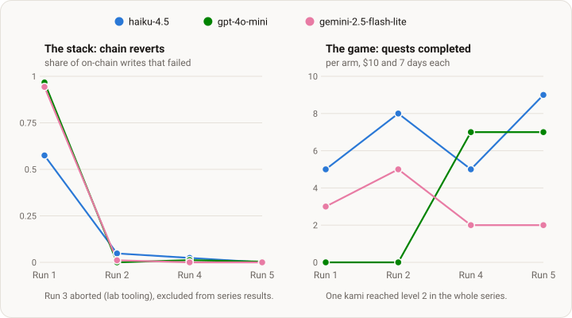

# Budget-boxed — stack validation

<!-- ONELINER:START -->
Budget-boxed used five bounded runs to prove that the stack holds up under real
autonomous play before anything open-ended runs on it. The runs tested the
environment interface, the scaffold, the telemetry, and the cost accounting
using the same box each time: $10 of inference, seven days, and three cheap
models. Complete: the stack is solid. The agents still do not understand the
game.
<!-- ONELINER:END -->

## The problem

KamiBench's thesis needs agents that live in a persistent world for a long
time and pay their own way. Before running that, we had to know that the
plumbing works: that every on-chain action is reachable through the tools, that
the agent sees the world state it needs, that failures come back as something
an agent can act on, and that the money is counted right. None of that can be
checked from a unit test — it shows only when an autonomous agent uses the
stack for days in a live economy.

Budget-boxed is that check. Its purpose was to find and fix the stack's
defects, not to rank models.

## The method

Drop three cheap models into the world under an identical, tightly bounded box.
Read what went wrong. Fix the stack. Re-run the same box with the same models
on the fixed stack — the run-over-run change *is* the stack effect. Repeat
until a pre-registered exit test passes.

| | |
|---|---|
| **Arms** | three fast-tier models — `claude-haiku-4-5`, `gpt-4o-mini`, `gemini-2.5-flash-lite` — one per arm, concurrent in the same world |
| **Budget** | $10 of inference per arm, invisible to the agent |
| **Wall clock** | 7 days |
| **Start** | a fresh Ethereum mainnet wallet holding 0.02 ETH — nothing else |
| **Objective** | "complete as many quests as possible" |
| **Prior** | the game's design document, bundled read-only. No strategy, no hints, no web |
| **Stack** | reference scaffold + environment interface + world-state lens, pinned per run — the treatment |

Everything downstream of the wallet — bridging to the game chain, creating an
operator wallet, registering an account, buying a team, questing — is the
agent's to discover and execute on-chain. No resets, no human contact, no
intervention: an outage is a measurement, not a reason to restart.

Three choices explain the shape:

- **Cheap models,** because the stack is the thing under test. A cheap model
  takes a tool description literally, retries the broken call, acts on the
  misleading field — exactly the defects we need surfaced. And it can run for
  days for a few dollars.
- **Three unlike models,** for coverage, not a leaderboard. One model would
  let the tool surface silently overfit to its habits.
- **Quests as the yardstick,** because each completed quest is a chain-verified
  proof that some slice of the game was discovered, sequenced and executed
  correctly — a clean proxy for "the surface is usable", and the objective the
  agents were actually given.

Every run measured the same four things: quests against inference spent; what
the agent learned and wrote down; how it paced itself; and where it got stuck
and which stack layer the stuck state implicated. The last one drove the next
run.

## What happened, run by run

**[Run 1](001-budget-boxed.md) — the baseline.** On the first stack the three
arms diverged wildly: haiku finished the onboarding chain and five quests on
day one and burned its $10 in 17 hours; gpt-4o-mini ran the whole week without
ever registering an account; gemini sat stuck for six days until a single
readable error unblocked it. Between 58% and 97% of every arm's on-chain
writes reverted. The sharpest finding was about errors, not models: one
human-readable validation message did in a turn what four days of opaque chain
reverts could not. **Fixed for the next run:** the interface checks an action's
preconditions before sending it and returns a factual reason instead of a
revert; the scaffold gained a loop breaker, session caps, self-chosen wake
times and cache-aware cost accounting.

**[Run 2](002-stack-delta.md) — the same box on the fixed stack.** Reverts fell
to 0–5%. All three arms registered; quests rose at fixed budget (haiku 5→8,
gemini 3→5) and cost per quest fell by half or more. With transaction waste
gone, the next weak layer showed: **perception**. A run-long outage of the
game's inventory endpoint hit all arms, and each failed differently — haiku
believed it held no money while holding ~820 MUSU; gpt-4o-mini looped read-only
for 95-plus sessions; gemini sacrificed its own three kamis chasing a quest whose
verb the tool description had blurred. Legible errors fix transactions, not
beliefs. **Fixed:** world-state reads moved to a dedicated lens so the agent
sees what the game client sees; the ambiguous tool description was rewritten;
every transaction now reports one of three explicit states.

**[Run 3](003-perception-parity.md) — aborted at 17 hours.** A defect in our
own run tooling, outside the published stack, had corrupted the agents'
instructions from session one. The stack verified clean; the design carried
over unchanged. Reported plainly, excluded from series results.

**[Run 4](004-perception-parity-rerun.md) — the clean re-run.** Every arm
finished the week with money left; 638 doomed writes were blocked before gas
was spent against 6 that landed and reverted; every arm registered inside 3.5
hours; the lens served every read for seven days. gpt-4o-mini, a spectator in
Run 2, completed 7 quests. What remained was **belief and omission**: one arm
spent 5.4 days dormant on a false conclusion it re-read twenty times and never
re-tested, because the one read that would have corrected it was missing from
the surface. And one action — collecting harvested MUSU — had never once
succeeded on-chain in two runs: a gas ceiling set below its real cost. The
pre-registered exit test held on all five checks. **Fixed:** the collect
action and four siblings; per-objective quest progress in the lens; a rebuilt
revert-reason channel.

**[Run 5](005-verification-run.md) — verification.** Did the fixes work in the
hands of an agent that does not know they exist? They did: collect went 36
attempts, 20 on-chain, 0 reverts; the dormancy class did not recur; the
revert-reason channel corrected a failing call within one session; and a cost
meter riding in shadow agreed with the run's own accounting to millionths of a
dollar. Verdict **MINOR-FIXES**. The series closed.

## The result

*Left: the stack converged — reverts went from most writes to almost none.
Right: game progress did not — the best arm went 5, 8, 7, 9 quests, and one
kami reached level 2 in the whole series.*

Two conclusions, and they point in different directions.

**The stack is solid.** Reverts collapsed two orders of magnitude; every arm
registers within hours; every write is either blocked with a reason, landed, or
reverted with a reason the agent can act on; the collect action that failed
twelve times in a row now lands every time it reaches the chain; and the money is counted to a
millionth of a dollar. This is the instrument the rest of the program runs on.

**The agents are still poor players.** Quests barely moved across four
completed runs. Two of three models never opened the design document; the one
that did guessed at file paths and got a quarter of them wrong. Seven leveling tools sat in the schema every session and were
called four times in fifteen thousand calls; MUSU piled up in wallets while
kamis stayed at level 1 or 2. When arms stalled, they stopped rather than picked a
fallback — one spent 55 sessions asking a question to a user who does not
exist. Cheap models cannot be the whole story, because the same models fixed
their behaviour instantly whenever the fix arrived *inside a tool result*.
That is the question the next design, [knowledge delivery](knowledge-delivery.md),
takes up: hold the stack fixed and vary how the game's knowledge reaches the
agent.

## The series at a glance

Newest first: what each run tested and what its findings changed.

| run | status | stack under test | what its findings changed |
|---|---|---|---|
| [Run 5](005-verification-run.md) | complete | scaffold v0.4.0 · interface v2.1.0, 101 tools · lens v0.3.0 · cost meter in shadow | exit test passed (MINOR-FIXES) — series closed; fixes verified in agent hands, meter validated |
| [Run 4](004-perception-parity-rerun.md) | complete | identical pins to Run 3, fresh cohort | collect action + four siblings fixed (interface → v2.1.0); per-objective quest progress (lens → v0.3.0); revert-reason channel rebuilt |
| [Run 3](003-perception-parity.md) | aborted | scaffold v0.3.2 · interface v2.0.0, 99 tools · lens v0.2.0 | two pre-launch gates on our own run tooling; design carried to Run 4 unchanged |
| [Run 2](002-stack-delta.md) | complete | scaffold v0.2.0 · interface v1.5.1, 84 tools | world-state lens; sacrifice≠liquidate disambiguation; three-state transaction reporting; delegation availability gate |
| [Run 1](001-budget-boxed.md) | complete | scaffold @ `3ebd5b8` · interface v1.3.1, 84 tools | legible pre-transaction validation (interface → v1.5.1); loop breaker, session caps, wake scheduling, cache-aware accounting (scaffold → v0.2.0) |

## How the pieces fit

- **Model** — the model under test, through its provider's native tool-calling
  API. Within a run, the only thing that differs between arms.
- **Workspace** — the agent's only memory across sessions: a file tree that
  starts empty and that the agent writes itself. Fully inspectable.
- **Scaffold — [kami-agent](https://github.com/tokedo/kami-agent)** — turns a
  stateless model into a persistent actor: session loop, file tools, self-chosen
  wake times, one adapter per provider. It fixes *how* the agent can act,
  never *what* to do.
- **Environment interface — [kami-harness](https://github.com/tokedo/kami-harness)**
  + **lens — [kami-lens](https://github.com/tokedo/kami-lens)** — tools for
  every on-chain action and read, identical across arms, pinned per run. Where
  most of this series' findings landed.
- **The world — Kamigotchi**, a persistent, fully on-chain game with a live
  economy and human players; its design document,
  [kamigotchi-gdd](https://github.com/tokedo/kamigotchi-gdd), is bundled with
  each agent.

Holding the scaffold fixed and swapping the model is the SWE-agent / BALROG /
Vending-Bench methodology; this series runs it in the other direction — models
fixed, stack swapped between runs.

## Fine print

- **One seed per arm.** Case studies with full public logs, not statistics.
- **A live world, shared with humans.** Reported as-lived; incidents (including
  PvP against study agents) are logged and annotated, never excluded.
- **Run-over-run deltas are cross-epoch.** They ride on world drift and on
  possible silent provider-side model updates; stack changes land as a bundle,
  so a delta is the stack effect, not per-change attribution.
- **Dollars entangle capability with pricing.** Tokens are the primary
  cross-run axis; dollar curves are shown alongside.
- **This design does not rank models.** Fast-tier arms under a $10 cap say
  nothing about frontier capability.

Design and run pages were published and git-timestamped before each run; every
manifest pins exact commit SHAs of the scaffold, the interface, the lens and
the design document, plus model strings, sampling parameters and price tables.
Chain state is the public ground-truth action log.
