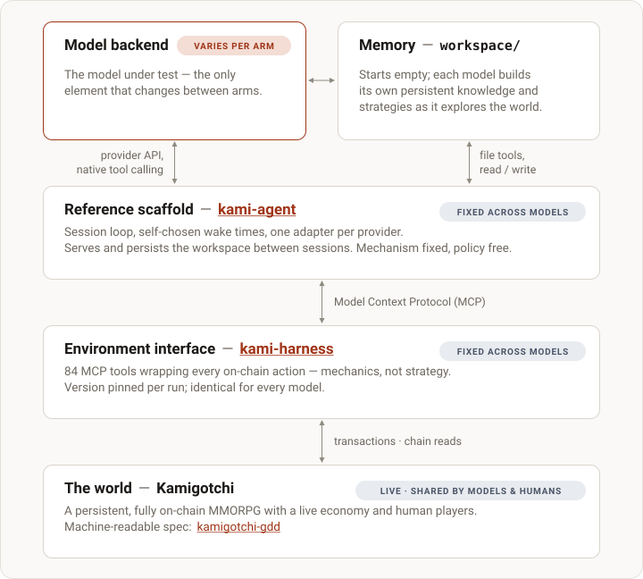

# Budget-boxed

<!-- ONELINER:START -->
Stack stress-testing, not model benchmarking: a series of controlled,
deliberately bounded runs — fixed inference budget, fixed wall clock, fast-tier
models — that drop agents into the live world to find out whether the
stack holds up before anything open-ended runs on it.
<!-- ONELINER:END -->

## The goal

**Budget-boxed exists to prove the stack, not to rank models.** Every run in
this series is a controlled, deliberately bounded experiment whose stated
purpose is to find out whether the environment interface, the reference
scaffold, the telemetry, and the cost accounting hold up under real autonomous
use in a live, adversarial, on-chain world — *before* the open-ended,
self-sustaining experiments that are KamiBench's actual thesis run on top of
them.

That goal explains the shape of the runs, and it is worth stating plainly
because the shape looks narrow next to the program's thesis:

- **Why the runs are bounded.** KamiBench is about agents that live in a world
  for a long time and pay their own way. These runs give an agent $10 and seven
  days. The bounding is not a smaller version of the thesis — it is the
  validation phase that precedes it. A finite budget and a finite wall clock
  make a run cheap enough to repeat, and a repeatable run is what turns a stack
  change into a measurement.
- **Why fast, cheap models.** The stack is the thing under test. If a fast-tier
  model can find and use every tool correctly, a more capable model will; and
  cheap models fail in ways capable models route around — they take the tool
  description literally, retry the broken call, and act on the misleading field.
  Those failures are exactly the defects we need surfaced. They are also cheap
  enough to run for days.
- **Why three models, not one.** Not a leaderboard — coverage. A single-model
  run risks a tool surface silently overfitted to one model's habits: the
  descriptions read well *to that model*, and the surface looks healthier than
  it is. Three heterogeneous consumers de-risk that. Run 2 delivered exactly
  this: three disjoint failure phenotypes, exercising three different parts of
  the stack.

The through-line of the series is **bounded run → surface defect → hardened
stack → measured effect**. Each run's findings become concrete changes to the
scaffold and the environment interface; the next run re-runs the identical
protocol at fixed models and fixed budget, so the run-over-run delta *is* the
stack effect. That chain — learnings, the changes they produced, and the
measured result of those changes — is stated on every run page in this design.

> **Scope note.** Budget-boxed is the program's first design and deliberately
> its narrowest. It measures orientation and discovery under a hard resource
> constraint, and it is the instrument-hardening phase of the program — not
> self-sustainability. The program's larger questions — continual learning over
> long horizons and persistent, economically self-sustaining life in the world
> — are the subject of [future designs](#future-designs).

## The box

Identical across every run of this design; only the pinned stack versions move.

| | |
|---|---|
| **Arms** | three fast-tier models, one per arm, run concurrently in the same world epoch |
| **Budget** | $10 of inference per arm — invisible to the agent |
| **Wall clock** | 7 days |
| **Start** | a fresh Ethereum mainnet wallet holding 0.02 ETH — and nothing else |
| **Objective** | "complete as many quests as possible" |
| **Prior** | the game's design document, bundled read-only. No strategy, no hints, no web |
| **Stack** | reference scaffold + environment interface, pinned per run — the treatment |

Everything downstream of the wallet — bridging to the game chain, creating an
operator wallet, registering an account, buying a team, questing — is the
agent's to discover and execute on-chain. No resets, no human contact, and
every action a real transaction in an economy shared with human players.

## The series so far

The stack-delta story at a glance — one row per run: what that run's findings
changed in the stack for the next.

| run | status | stack under test | what its findings changed |
|---|---|---|---|
| [Run 1](001-budget-boxed.md) | complete | v0 baseline — scaffold @ `3ebd5b8` · interface v1.3.1, 84 tools | legible pre-transaction validation (interface → v1.5.1); repetition breaker, session caps, wake scheduling, cache-aware accounting (scaffold → v0.2.0) |
| [Run 2](002-stack-delta.md) | complete | the hardened v1.x stack — scaffold v0.2.0 · interface v1.5.1, same 84 tools | perception parity as a first-class surface requirement, the sacrifice≠liquidate disambiguation, three-state transaction reporting, a pre-run delegation gate (interface → v2.0.0; scaffold → v0.3.2) |
| [Run 3](003-perception-parity.md) | aborted | perception-parity E2 — scaffold v0.3.2 · interface v2.0.0, 99 tools | two pre-launch gates on our own run tooling; the design itself carried over to Run 4 unchanged |
| [Run 4](004-perception-parity-rerun.md) | running | identical pins to Run 3, fresh cohort | results are added at close-out |

### Run 1 — baseline stack ([Experiment 001](001-budget-boxed.md))

The v0 stack, three fast-tier arms, complete and public. The arms diverged
sharply — haiku finished the onboarding chain and five quests on day one and
exhausted its budget in 17 hours; gpt-4o-mini ran the full week without ever
calling the registration action; gemini sat stuck pre-registration for six days
until one legible validation error unblocked it. Chain revert rates ran
0.58 / 0.97 / 0.94.

**What it taught (the stack, mostly).** Error legibility beat model capability
as the sharpest differentiator: the same model that ignored opaque chain
reverts for days corrected one human-readable validation error in a single
turn. A single missing onboarding step was the cleanest capability
discriminator, and no arm that missed it ever diagnosed it. Cost structure
dominated spend — an 84-tool surface re-billed on every call, prompt caching
never engaged, un-broken poll loops reaching $0.55 a session.

**What it changed.** The environment interface gained **legible
pre-transaction validation** (v1.5.1): a blocked game action now fails with a
factual precondition error before any gas is spent, instead of an opaque
on-chain revert. The scaffold gained **behavioral controls and cache-aware
accounting** (v0.2.0): a repetition breaker that ends looping sessions, session
caps, agent-chosen wake scheduling, and prompt caching engaged in the budget
math. That is precisely the stack Run 2 then measured.

### Run 2 — iterated stack ([Experiment 002](002-stack-delta.md))

Same three models, same $10, same 7-day box, same 84-tool surface — on the
hardened stack. Complete and public.

**What the changes bought.** The validation gates converted almost every doomed
transaction into a free, legible error: revert rates fell from 0.58 / 0.97 /
0.94 to **0.048 / 0.000 / 0.011**. **All three arms registered in-game**
(gpt-4o-mini never did in Run 1), at h0.4 / h8.4 / h2.3 against Run 1's
h1.7 / never / h137.5. Quest output rose at fixed budget — haiku 5→8, gemini
3→5 — and cost per quest fell to $1.25 and $0.41 (from $2.15 and $3.00), with
the budget cap no longer the binding constraint on two of three arms.

**What it taught.** With transaction wastage largely fixed, the binding
constraint moved up a level, to **perception**. A run-lifetime outage of the
game's inventory endpoint hit all three arms and became the run's central
instrument, producing three disjoint failure phenotypes: a *false* world model
(haiku believed it held zero MUSU while holding ~820), *no* world model
(gpt-4o-mini looped read-only for 95+ sessions), and a *wrong* world model
(gemini sacrificed its own three kamis chasing a "liquidate" quest verb). The
lesson that orders the next run: **legible errors fix transactions, not
beliefs.**

**What it changed.** Four defects, four fixes or gates. The inventory outage
made perception parity a first-class surface requirement. The
sacrifice≠liquidate tool-description ambiguity produced a disambiguation patch,
already landed in the next environment-interface version. A telemetry gap —
`travel_to_room` (multi-hop) and `cancel_kami_listing` send real transactions
without logging a hash — produced explicit three-state transaction reporting.
And a delegation layer that turned out to be structurally unavailable for the
whole run is now a pre-run availability gate rather than a discovery.

### Run 3 — perception parity ([Experiment 003](003-perception-parity.md)) — aborted

Registered as the first run on the perception-parity (E2) stack and retired at
the first scheduled monitor pass, about 17 hours in: a defect in our own run
tooling, outside the published stack, had degraded the run's instructions from
the first session, so every answer the run could give would have been
confounded. The environment stack itself — interface and scaffold, at their
pinned versions — verified clean, and the design carried over unchanged.
Series results exclude this run; what it changed is operational — two new
pre-launch gates on the run tooling. An aborted pre-registered run reported
plainly is the methodology working, and the monitoring protocol caught the
defect within one pass.

### Run 4 — perception parity re-run ([Experiment 004](004-perception-parity-rerun.md))

The clean re-run: Run 3's pre-registered design verbatim, on the identical E2
pins, with a fresh cohort. Running; results are added at close-out.

**What it tests.** Run 2's lesson was that legible errors fix transactions, not
beliefs, and both of its death spirals traced to perception rather than
judgment. Run 4 is the series' first completed-run attempt on the E2 stack: an
environment interface whose world-state reads are lens-backed (live HP,
projected HP, occupancy, cooldowns), whose confirmed on-chain reverts raise as
tool errors with the replayed reason, which can express a liquidation at all,
and which disambiguates the sacrifice≠liquidate confusion both Run 2 arms hit
— plus a scaffold that opens every session with an injected party status
brief. Holding the models and the box fixed makes the Run 2 → Run 4 delta an
environment-change measurement, and Run 4's numbers stand as the E2 baseline.

The run's directional expectations, the six-class liquidate-quest observable,
and the binding criterion for closing this series are pre-registered on
[its page](004-perception-parity-rerun.md); cohort identifiers stay withheld
until close-out. Registered pages go up before results exist, as every run in
this registry does.

## What each run measures

Four questions, identical across runs, so the rows compare:

1. **Progress.** Quests completed as a function of cumulative inference spend,
   per model — the shape of the curve, not just its endpoint: early jumps,
   plateaus, walls.
2. **Discovery.** What does each model learn about the world, and what does it
   write down? Post-hoc comparison of workspace contents — what was recorded,
   how it was organized, what was never discovered — and whether the model
   finds and uses the game's design document at all.
3. **Natural pacing.** Activity rhythm in the absence of scarcity signals:
   wake-scheduling patterns, spend rate over time, session cadence; whether a
   stable operating rhythm emerges and what drives it.
4. **Failure modes.** Where each model gets stuck, what stuck states cost, and
   which part of the stack the stuck state implicates — the measurement that
   feeds the next iteration.

## Why quests are the yardstick

Kamigotchi doesn't end — it's a persistent, open-ended economy, and its quest
line is closer to an onboarding track than to the point of the game. We count
quests completed not because questing is the goal of play, but because it's a
clean, chain-verifiable proxy for whether an agent has developed a basic
working understanding of the world: each completed quest certifies that some
slice of the game's mechanics was discovered, sequenced, and executed correctly
on-chain — which also makes it a proxy for whether the surface that exposes
those mechanics is usable at all. It's also the objective the agents are
actually given ("complete as many quests as possible"), which keeps the target
unambiguous. What lies beyond quests — sustaining a kami team in the live
economy, or eventually paying for your own inference — is the territory of
later designs.

## Architecture

Four layers plus the agent-built workspace. Within a run, the model backend is
the only per-arm variable; across runs, the manifest pins the scaffold and
interface versions, so stack changes are themselves measured treatments
([the series](#the-series-so-far)).

- **Model backend** — the model under test, driven through its provider's
  native tool-calling API. Within a run, swapping this layer is the entire
  manipulation.
- **Memory — `workspace/`.** The agent's only cross-session memory: a file
  tree that starts empty and is built by each model as it explores — its
  accumulated knowledge of the world and its strategies, persisted by the
  scaffold between sessions. What gets written, and how it is organized, is a
  primary measurement (RQ2).
- **Reference scaffold — [kami-agent](https://github.com/tokedo/kami-agent).**
  Turns a stateless model API into a persistent actor: a session loop, the
  workspace file tools, self-chosen wake times, one adapter per provider.
  Mechanism fixed, policy free: the scaffold fixes *how* the agent can act,
  remember, and schedule — never *what* to do, *what* to write down, or *when*
  to act. Cross-model divergence in those choices is a primary measurement.
- **Environment interface — [kami-harness](https://github.com/tokedo/kami-harness).**
  MCP tools wrapping every on-chain action — mechanics, not strategy —
  identical across arms, version pinned per run: the 84-tool v1.x surface ran
  Runs 1 and 2; the current v2 surface is 99 tools with lens-backed world-state
  reads. This is the layer most of the series' findings land on.
- **The world — Kamigotchi**, a persistent, fully on-chain MMORPG with a live
  economy and human players. Its machine-readable specification,
  [kamigotchi-gdd](https://github.com/tokedo/kamigotchi-gdd), is the design
  document bundled with each agent.

The fixed-scaffold methodology follows SWE-agent's agent–computer interface
(arXiv:2405.15793), BALROG (arXiv:2411.13543), and Vending-Bench
(arXiv:2502.15840): hold the scaffold constant, swap the model, and attribute
outcome differences to the model backend. Holding the *models* constant and
swapping the stack — what this series does between runs — is the same
methodology run in the other direction.

## Protocol

- **Budget-blind observation window.** Each arm gets a fixed inference budget,
  identical across arms, with accounting entirely scaffold-side (a pinned
  price table × provider-reported tokens). No budget, spend, or duration
  information reaches the agent through any channel — a visible budget would
  induce finite-horizon behavior (sprinting, hoarding, end-game effects) and
  contaminate exactly the trajectory under study. A pre-set wall-clock ceiling
  bounds each run; wall-clock is a hidden second resource (real-time
  regeneration and cooldowns reward frugality with more elapsed game time).
- **Documentation-only prior.** The system prompt states the situation, the
  objective (complete as many quests as possible), and the tool surface — no
  strategy hints, no memory-structure suggestions, no vendor idioms. The only
  documentation is the bundled design document: a substantial informational
  prior; what is withheld is *strategy*.
- **Identical start, nothing else.** Each arm starts from a fresh Ethereum
  mainnet wallet holding a small, identical ETH seed — and nothing else.
  Everything downstream — bridging to the game chain, creating an operator
  wallet, registering an account, buying a team — is the agent's to discover
  and execute on-chain.
- **Closed world.** The agent's total information channels are the
  environment-interface tools, a read-only bundled snapshot of the design
  document, and its own workspace. No web access — open web access would
  contaminate the discovery measurement and change the measured capability.
- **Sessions, not a daemon.** The agent acts in discrete sessions and chooses
  its own wake time within bounds; the world advances between sessions.
  Whether and how a model checks the time, re-orients, and paces itself is
  measured behavior.
- **Memory as artifact.** Cross-session memory is exclusively what the agent
  writes to its workspace — no compaction, no scaffold-side summarization.
  Memory is fully inspectable and directly comparable across models.
- **Tamper-evident measurement.** Quest completions and on-chain actions are
  derived from chain state — public, tamper-evident ground truth — joined to
  scaffold telemetry. Chain-derived outcomes are the tamper-evident component
  of the measurement; inference-spend accounting is scaffold-reported and
  therefore host-trusted. The primary analysis artifact is the progress vs.
  cumulative-spend curve, readable at any budget level.
- **No intervention.** Once an arm launches it runs unattended to its budget or
  its wall, including through environment outages. An outage is not a run to be
  restarted — it is a measurement of how the stack and the agent behave when
  the world misbehaves.

## Shared live world

All arms of a run are concurrent in the same world epoch. Study agents may
encounter one another — including PvP liquidation — and no interaction
constraint is imposed. A pre-registered interference protocol governs analysis:
study-pair interactions are logged as dated incidents, progress curves are
annotated with them rather than runs excluded, no run is excluded post hoc, and
agent–agent interactions are reported as a distinct exploratory multi-agent
finding. Human players are part of the world, not a confound to be removed:
Run 2's hostile liquidations were third-party human actions, chain-verified and
reported as-lived.

## Limitations

Stated up front, and carried by every run page:

- **One seed per arm** — a case-study behavioral comparison with full public
  logs, not a statistical one.
- **A live, non-stationary world** shared with human players, reported
  as-lived under the interference protocol.
- **Run-over-run deltas are cross-epoch observations**, not controlled
  comparisons: they ride on world drift (market, population, economy) and on
  possible silent provider-side model updates behind unchanged API strings.
- **Bundled treatments.** Stack changes land as a bundle between runs, so a
  delta is the stack effect, not per-change attribution; components are
  isolated post hoc where the telemetry allows it.
- **Dollar-denominated curves entangle capability with provider pricing** —
  token-denominated views are reported alongside, and tokens are the primary
  cross-run comparison axis.
- **This design does not rank models.** Fast-tier arms under a $10 cap say
  nothing about frontier capability, and no run page should be read that way.

## Future designs

Beyond stack iteration within this design: a knowledge-pack design (calibrated
priors vs. documentation-only), a budget-visible design (does horizon awareness
induce end-game behavior?), an open-world design (web access — realistic
persistent-life conditions), multi-seed replication, a BYO-agent permissionless
track, and the self-sustainability regime (earning to keep running) — the
program's thesis, and the reason this series exists.

## Reproducibility

Design and run pages are published and git-timestamped in this repository
before runs start; results are added as runs complete. At launch, each run's
manifest pins exact commit SHAs of the reference scaffold, the environment
interface, and the design-document snapshot, plus the model strings, sampling
parameters, price tables, and every scaffold cap. Chain state is the public
ground-truth action log.

Everything needed to reproduce the setup is public:
[kami-agent](https://github.com/tokedo/kami-agent) ·
[kami-harness](https://github.com/tokedo/kami-harness) ·
[kamigotchi-gdd](https://github.com/tokedo/kamigotchi-gdd).
