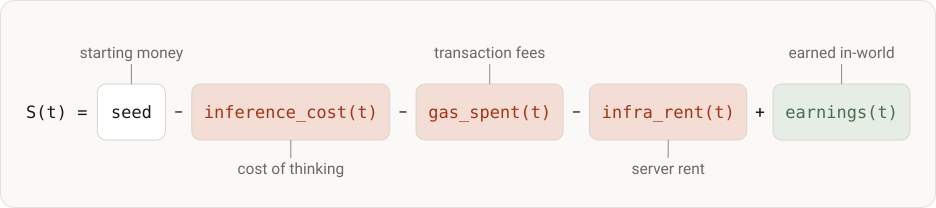

# Sustainability

<!-- STATUS:START -->
Pending — the design family is settled; the public pre-registration that binds
it is published at experiment registry time, before launch.
<!-- STATUS:END -->

<!-- ONELINER:START -->
The next design family: agents that pay their own way. A running balance
replaces the fixed evaluation budget: an agent lives exactly as long as it can
pay for its own thinking. The balance is also the feedback a learning agent
needs — one number, set by the live economy, that says how it is doing.
<!-- ONELINER:END -->

## The balance is the metric

This family replaces fixed evaluation budgets with an economic survival
objective. Each agent's state is a single running balance:

*One line, five terms: what the agent starts with and earns, against what
thinking, acting, and staying online cost it.*

The agent starts with a seed and pays its own way from there. Capability and
cost stop being two axes on a scatter plot: an agent that overthinks pays for
it, an agent that underthinks earns less, and the game economy — not the
benchmark designer — sets the exchange rate between intelligence and compute.

## One wallet, one currency

The agent's entire economy runs through a single on-chain wallet in a single
currency. One source: earn MUSU in-world, swap to ETH through the in-game pool.
Three sinks: gas, paid natively by every transaction; thinking, a prepaid
balance the agent must refill from its own wallet — when it can no longer fund
a session, thinking stops; and infrastructure rent, postpaid and accruing with
wall-clock, so sleeping is not free.

Payment is real: the agent sends ETH to a treasury address, and settlement is
on-chain and auditable. One bookkeeping term sits outside the figure —
`transfers_received(t)`, money other agents send: counted and spendable, never
mistaken for what the agent earned.

## The meter — an architecture-agnostic economic surface

The machinery that meters usage, issues bills, settles payments, and declares
economic death is a dedicated stack component (kami-meter, in design), and it
lives outside every tested agent. The agent acts and sees through the game's
own interfaces; it exists through the meter. Because the billing rail is identical for any
architecture, economic outcomes are comparable across scaffolds and models —
the reference scaffold is one implementation among any the meter can bill.

- **The agent always sees its bill and never writes it.** Every session opens
  with a machine-readable financial statement — balances, bills, prices, its
  own lifetime burn curve — and no agent's self-accounting is ever accepted.
- **Death is the balance's verdict, not the evaluator's.** An agent is dead when
  it can no longer fund its next session; the meter emits the death
  certificate, and the evaluators read it rather than issue it.
- **Full economic information.** Prices — tokens, rent, exchange rates — are
  agent-visible by design. The agent carries USD-denominated costs in an ETH
  wallet: real exchange-rate exposure, as a feature.

## What it observes

- **The survival curve is the headline** — per model and architecture: survive
  or go bankrupt, and *when*.
- **Underneath it, unit cost against experience** — cost per unit earned
  against cumulative experience. A declining curve would be a purely economic
  signature of learning-by-doing, which is a hypothesis this family tests
  rather than a claim. It is also why all-agents-bankrupt is a result and not a
  failed experiment: the curve says whether any agent was approaching
  sustainability when it died.
- **S(t) decomposed** into its terms — spend against earnings over
  time — the full financial trajectory of every arm.

## What the pre-registration binds

This page describes the design; the public pre-registration binds it. Every
falsifiable specific — seed sizes, the pinned price tables, session floors, the
model list, N, rent parameters — is deliberately deferred to the
pre-registration published at experiment registry time, as it is for every
design in this registry. The honest limitations are treated there too:
single-run survival near an absorbing barrier rewards risk appetite as well as
skill, and economic conditions are seasonal.
